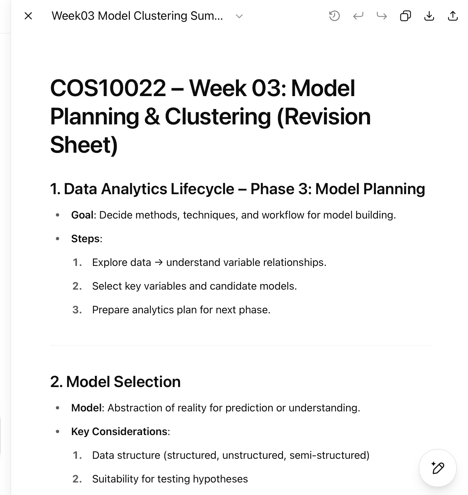

# 🔍 Research & Learn

1. What AI tools are typically used for your role?
   Here is some AI would help for my role : - GitHub Copilot: Autocompletes React component logic, suggests JSX structures, and helps with hooks like useEffect, useState, etc. - ChatGPT: Great for understanding tricky React concepts, optimizing component performance, or converting pseudocode to working React code. - Codeium (alternative to Copilot): Another AI autocomplete tool that works well with JS/React. - AI-powered documentation tools: Tools like Mintlify or Swimm can help generate internal docs for your components automatically.
2. What are the benefits and risks of using AI in a professional setting?
   Here is some benefits of using AI: - Enhanced efficiency and productivity - Improved decision-making - Enhanced employee engagement through learning and development - Better work-life balance - Enhanced customer experience
   Here is some risks of using AI : - Potential job displacement - Lack of human touch - Ethical and privacy concerns - Dependency on technology - Skills gap and training needs
3. What types of information should never be entered into AI tools?
   - Personally Identifiable Information (PII)
   - Financial and Banking Information
   - Trade Secrets and Bussiness Information
   - Biometric Data
   - Medical Records and Health Data
   - Private Conversations and Creative Ideas
4. How can you fact-check and validate AI-generated content to ensure accuracy?
   When evaluating AI-generated information, follow these fact-checking tips to ensure reliability: - Always cross-check AI-generated facts with authoritative sources such as research papers, government websites, academic institutions, and established news publications. These respected outlets maintain high standards for accuracy and help confirm whether the information is factual. - Specialized websites and AI fact-checking tools offer independent verification. Consider using sources with a URL ending in .org, as they are usually non-commercial. - AI often pulls from multiple sources, but it may not always cite them correctly. A quick online search helps you find the original source of a claim to confirm its validity. - AI models are trained on vast datasets, which may include biased or misleading content. Evaluate whether the information presents multiple perspectives and whether any bias may be influencing the content. - News moves fast, and AI may provide outdated information. If you’re looking for up-to-date news, check publication dates and ensure the facts align with current events and developments before accepting them as true.

## 📝 Reflection

1. When should you use AI for assistance, and when should you rely on your own skills?
   When I get stuck and need to find a solution and I need to work faster at monotonous tasks, want to learn alternatives, or need a step-by-step guide to unfamiliar operations - I should use AI to help me. But do not bank on AI capabilities when making crucial design decisions or reviews of the code it generated regarding its accuracy and security and when there is an instance of a problem whose solution requires extensive knowledge of the app logic or customer requirements. Instead, AI is not the solution: it is a tool that has to be used jointly with my critical thinking and expertise in the sphere.
2. How can you avoid over-reliance on AI while still benefiting from it?
   Don't consider AI the crutch, but a support system to prevent the over-dependence on it to gain its benefit. Have the AI handle brainstorming or boilerplate prompt text or even give suggestions on debugging, but watch whatever it makes and read it over before accepting it. Use AI suggestions as a learning point and not a definitive answer, and solve my own problems first before using AI.The more active I remain in the process, and the more I develop my own skills, the more confidence I will achieve, and at the same time continue to enjoy the efficiency and speed of the AI.
3. What steps will you take to ensure data privacy when using AI tools?
   To remain privately safe utilizing AI devices, I will not use any sensitive or data that identifies me (such as genuine customer data, credentials, or inner project information) in requests. I will anonymize the code fragments or data before inserting information, and use AI tools that will not violate privacy rules and will not store information in an unsafe place. I will also read the terms of data usage of the AI tool and make sure that it meets the privacy standards of my organization - this will be crucial when I go on an internship with Focus Bear.

### 🛠️ Task

1. Identify one task you can improve using an AI tool, and try it out.
   There is a task that would very benifit when using AI tool which is summarize a massive text resource. Sometimes we need to read a few hundred of slides or file , AI tools will be really helpful to help us summarize the content and key point of the resources.
   Example: I have used ChatGPT to summarise 58 slides of powerpoint into one page
   
2. Review the AI-generated output critically—did it require editing or fact-checking?
   Yes. While ChatGPT provided a good starting point, it missed some important details and occasionally phrased things too generally.

   - Example before (AI output): “The project faced challenges with deadlines and resource allocation.”
   - After my edits: “In Sprint 2, the project failed to meet two important deadlines because of the complexity of the authentication module that was underestimated and insufficient resources of the backend.”

   This editorial clarified what was not clear about AI. I also updated some figures: ChatGPT originally summarized that there were approximately 60 slides, which I has corrected to 58 slides. I edited spelling and syntax to make it correct.
   Overall, AI helped speed up the summarization, but it still required manual refinement to add precision and remove small inaccuracies.
3. Document one best pratice you will follow when using AI tools at Focus Bears.
   I will always anonymize sensitive data before using AI tools**and**cross-check outputs with reliable sources to avoid errors.
