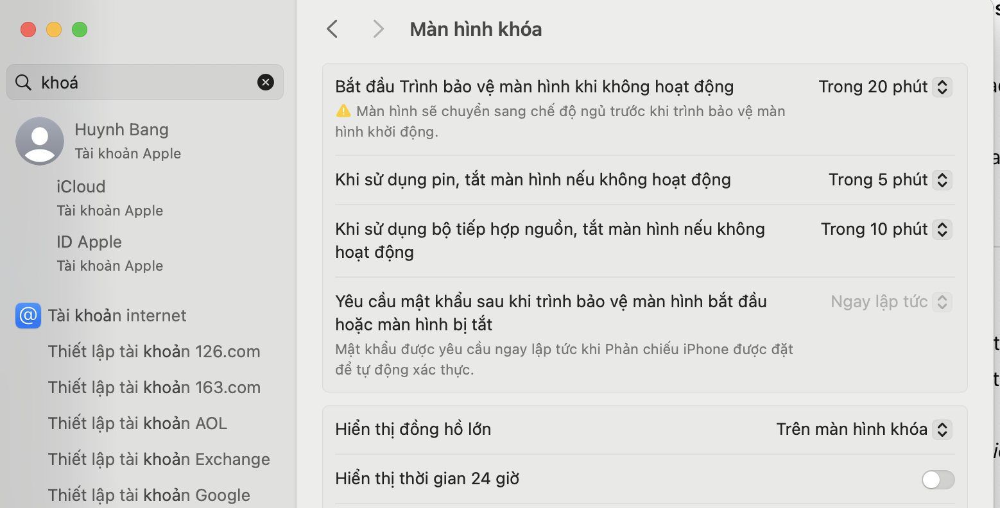
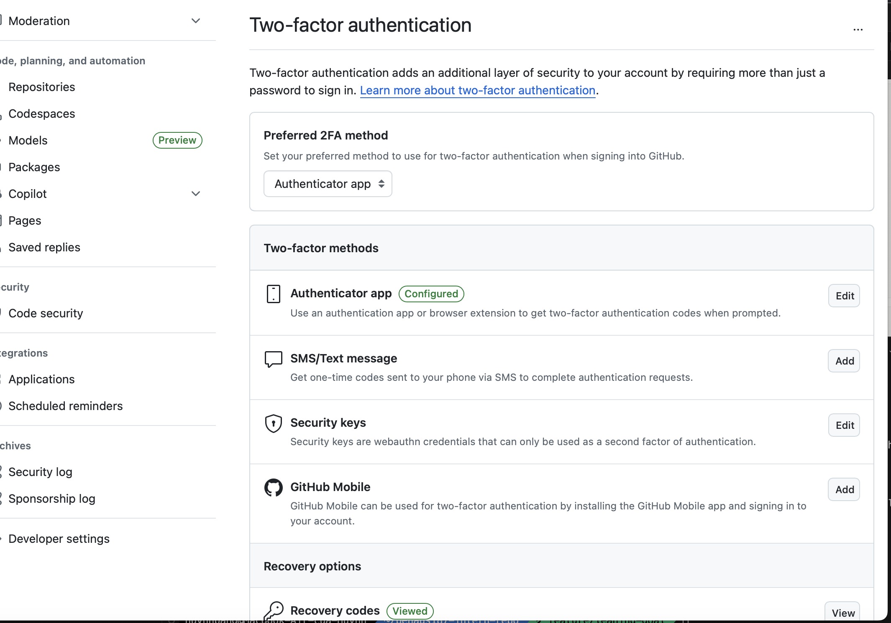

# 🔍 Research & Learn
1. What are common cyber security threats in a remote work environment?
    Common cyber security threats in a remote work environment include phishing attacks, weak passwords, unsecured networks, malware, and data leakage. Additionally, risky Wi-Fi networks, personal devices, and inadequate employee training can also pose significant risks. 

2. What are best practices for keeping your devices and accounts secure?
    To enhance the security of your devices and accounts, it's crucial to use strong, unique passwords, enable multi-factor authentication, and keep software updated. Be cautious of suspicious emails and links, and avoid public Wi-Fi for sensitive transactions. Regularly back up your data, and be mindful of what information you share online. 

3. Why is it important to lock your computer when away from your desk?
    Locking your computer when away from your desk is crucial for protecting sensitive information and preventing unauthorized access. It safeguards your work, personal data, and company information from potential breaches. Even a brief absence can expose your device to risks if left unlocked. 

4. How should you handle phishing attempts and suspicicous links?
    To handle phishing attempts and suspicious links, prioritize immediate action to minimize potential damage. First, avoid clicking any links or opening attachments in suspicious emails. If you've already interacted with the link or attachment, disconnect your device from the internet to prevent further spread of malware. Then, change your passwords for any potentially compromised accounts, and report the incident to your IT department or email provider. 

5. What makes a strong paswordm and why should you use a password manager?
    A strong password is long, random, and unique. It should include a mix of uppercase and lowercase letters, numbers, and symbols. Using a password manager is recommended to securely store and manage these strong passwords, especially since they can be difficult to remember. 

6. Why is two-factor authentication (2FA) important, and when should you enable it?
    Two-factor authentication (2FA) is crucial for enhancing account security by adding an extra layer of verification beyond just a password. It significantly reduces the risk of unauthorized access, even if your password is compromised. 2FA should be enabled on all accounts where it's offered, especially those containing sensitive information like email, banking, and social media accounts. 

📝 Reflection
1. What security measures do you currently follow, and where can you improve?
There are some security measures that I currently follow :
    - Use of strong, unique passwords amanaged with a password manager.
    - Two-factor authentication (2FA) enabled for all key accounts.
    - Regular software and OS updates.
    - Locking screen when stepping away from device.
    - Avoiding public Wi-Fi for sensitive work.
    - Cautious with email: don't click suspicious links or attachments.
2. How can you make secure behaviour a habit rather than an afterthought?
    To make secure behaviour a habit, intergrate it into my daily routine through small, consistent actions-like locking my screen when stepping away, using two-factor authentication, and storing files in encrypted clioud storage, automate security tasks where possible (e.g., software updates, backups) and set reminders for things like password changes or data clean-ups. Treat security like digital hygiene-somethign I fo regulargy not just when reminded- and stai informed with simple tips to build awareness over time.
3. What steps will you take to ensure your passwords and accounts are secure?
    To ensure my passwords and accounts are secure, i will use a password manager to create and store strong, unique passwords for each account. I will enable two-factor authentocation (2FA) wherever possible to add an extra layer of protection. I'll avoid reusing passwords, regularly review my account security settings, and stay alert for phising attempts or suspicious activity.
    
    
4. What would you do if you suspected a security breach or suspicious activity on your account?
    If I suspected a security breach or suspicious activity on my account, I would immediately change my password and enable or review two-factor authentication if it's not already active. I would check for unauthorized access or changes, log out of all devices , and report the incident to the appropriate support team or security contact. If sensitive data was involved, I'd follow my organization's incident response procedure and monitor my accounts closely for furher activity.
5. New Cybersecurity Habit at Focus Bear
    Habit: I will start reviewing my active sessions and access logs weekly to ensure no unauthorized logins.
    Example: On GitHub and Google Workspace, I will check “last account activity” logs and sign out unknown devices.
    Implementation: I’ll set a recurring Monday calendar reminder to quickly review my security dashboards.
