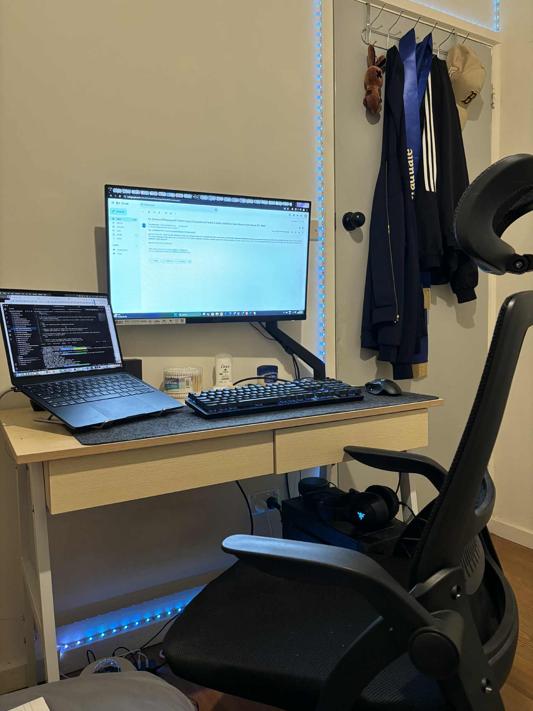

# 🔍 Research & Learn

1. What are the risks of using a laptop without an external monitor or keyboard?
    If poor postures are sustained for periods of time, there is potential for sprains and strains to develop, typically in the neck, back, shoulders, wrists and hands.

2. What ergonomic equipment can improve posture when working on a laptop? (e.g., laptop stands, external keyboards, ergonomic chairs)
    To improve posture while working on a laptop, consider using a combination of ergonomic equipment. Laptop stands elevate the screen to eye level, reducing neck strain, while external keyboards and mice allow for a more comfortable typing and mousing position. Ergonomic chairs with lumbar support and adjustable features can further enhance posture and reduce back pain.

3. What adjustments should be made to monitor height, chair position, and desk setup for a healthier workspace?
    To optimize a workspace for health and productivity, adjust your monitor, chair, and desk setup as follows: Ensure your monitor is at eye level, your chair supports your back with feet flat on the floor, and your desk height allows for comfortable typing with elbows at a 90-degree angle.

4. What are some daily habits that reduce the impact of prolonged laptop use? (e.g., movement breaks, posture checks, eye strain reduction techniques)
    To minimize the negative effects of prolonged laptop use, integrate movement breaks, posture checks, and eye strain reduction techniques into your daily routine. This includes taking frequent breaks, using the 20-20-20 rule for your eyes, ensuring proper posture, and adjusting lighting and screen settings.

## 📝 Reflection

1. What equipment changes can you make to improve your workspace setup? (e.g., using an external monitor, adjusting your chair, using a laptop stand)
    I do have a laptop stand to adjust the eye level to my laptop and at home I have set up a healthy working space with an external monitor, ergonomic chair and my laptop stand as well.

2. What behavioral changes can you implement to improve posture and reduce strain? (e.g., sitting upright, taking regular breaks, adjusting screen height)
    Normally, I have my ergonomic chair it can fix my back form but I have to change my behavior at our workspace because we do not have that. On the other hand, i have to taking regular breaks and drink more water as well.

3. How can you remind yourself to maintain good posture and take breaks throughout the day? (Hint: Use Focus Bear to schedule movement breaks!)
    I used Focus Bear app to remind me to take breaks and try to remember to maintain sitting straight.

### 🛠️ Task

1. Adjust your laptop setup based on ergonomic best practices.
    
    Done

2. Identify at least one piece of equipment that could improve your posture and comfort.
    Ergonomic chair, Monitor arm , Laptop stand, external mouse and keyboard.

3. Try using posture and movement reminders for a full workday and note any improvements. (Hint: Focus Bear has built-in reminders for movement breaks!)
    I used Focus Bear app to remind me to take breaks and drink water because I'm really lazy of drinking water. For example, during one of my coding sessions, Focus Bear popped up a "Drink water!" reminder. I took a quick 2-minute stretch, walked and get a cup of water, and came back feeling more alert. This small change helped me improve my health and drinking habit.
    
    Done

4. Document at least one workspace change or habit adjustment you made.
    I try to used our Focus Bear app to remind me of taking regular break.
