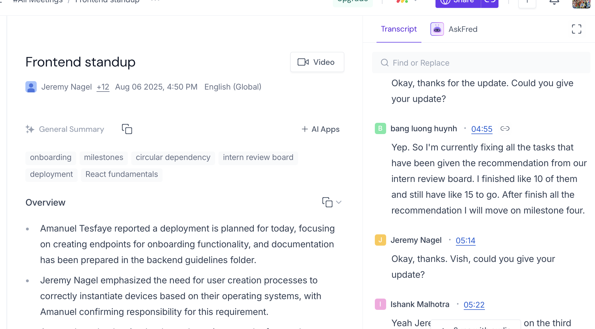
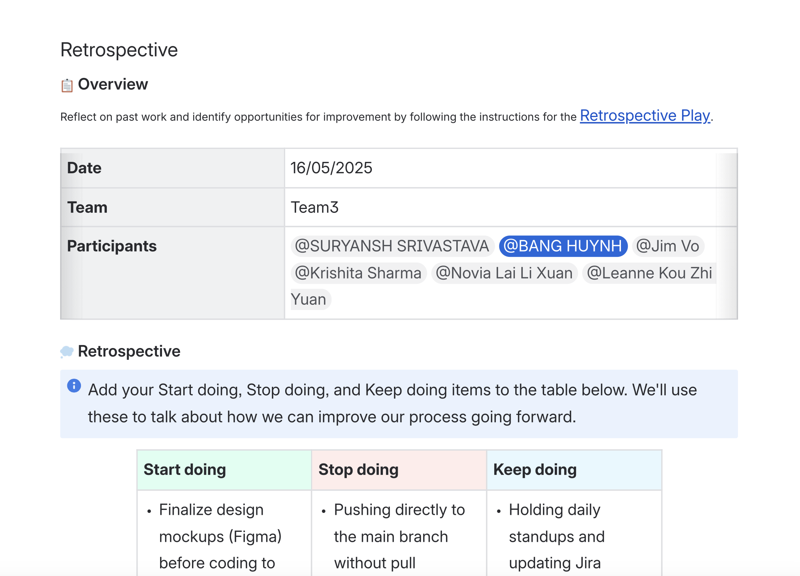

# 🔍 Research & Learn
1. What are the main Agile ceremonies, and what is their purpose?
    Daily Stand-ups:
        Purpose:
        To synchronize the team's work, identify any roadblocks or impediments, and plan for the day's activities. 
        In Scrum:
        A short, time-boxed meeting held daily, typically standing up to encourage brevity, where team members briefly share what they did yesterday, what they plan to do today, and any impediments they are facing. 
        In Kanban:
        Daily stand-ups serve a similar purpose of synchronizing and identifying impediments, but may not be as rigidly structured as in Scrum. 
    Sprint Planning (Scrum) vs. Continuous Prioritization (Kanban)
        Scrum has a structured sprint planning meeting at the beginning of each sprint, while Kanban relies on continuous prioritization of work items. 
    Retrospectives
        Purpose:
        To reflect on the sprint and identify areas for improvement in the team's processes, practices, and interactions. 
        In Scrum:
        A meeting held at the end of each sprint where the team discusses what went well, what didn't, and what changes they can make for the next sprint. 
        In Kanban:
        Retrospectives can be held less frequently, or as part of ongoing improvement discussions, but still serve the purpose of reflecting on the process and identifying areas for improvement. 
    Backlog Refinement
        Purpose:
        To ensure the product backlog is well-defined, prioritized, and estimated so that the team is prepared for sprint planning. 
        In Scrum:
        A process of continuously refining the product backlog to keep it ready for sprint planning. It may involve discussions, estimations, and breaking down large items into smaller user stories. 
        In Kanban:
        Backlog refinement is often integrated into the flow of work, with continuous prioritization and refinement happening as needed. 
2. How do Agile teams collaborate asynchronously and across time zones?
Agile teams can effectively collaborate across time zones and asynchronously by utilizing overlapping core hours for key discussions, leveraging asynchronous communication tools, and fostering a culture of clear documentation and flexible scheduling
# 📝 Reflection
1. How do Agile ceremonies help with communication and alignment?
    Ceremonies in the Agile method allow keeping track of communication, alignment and collaboration in a team. They offer a recurring, guided platform to see updates, reveal obstacles and alter plans based on reviews. As an illustration, stand-ups encourage daily communication thus keeping everybody informed and aligning the duties with the objectives of the sprints. The sprint planning makes priorities clear among the team member, restropectives enable constant growth, and reviews enable the stakeholders to give fruitful feedback. All the ceremonies foster transparency and accountability in a team, which is essential to the success in Agile.
2. Which ceremony do you think is most important for your role, and why?
    As a front-end developer intern, I will need to perform the most essential ceremony of the day, a daily stand-up. It provides me a consistent chance to share as to what I am doing, to point out any impediments as early as possible and remain in touch with the progress of the rest of the team. Being still a newcomer to the work process and the context of the agency, such rapid feedback is extremely helpful in obtaining support and correcting the guiding focus, should it be neccesary. It is also enabling me to develop confidence as I engage in team discussions in a well-organised and not-so-stressful manner.
# 🛠️ Task
1. Attend a stand-up meeting and observe how updates are shared.
    Attended the daily stand-up on 6/08/2025 via Zoom.  
    - Format: Each team member shared what they worked on today, plans for the nextday, and blockers.  
    - My update: Reported progress on updating the onboarding markdown files.
    - Screenshot evidence:  
      
    Done
2. Participate in a retrospective or review past notes from one.
    Retrospective participation (Example from previous group – ICT Project A, 16/05/2025)
    - Start doing: Finalizing design mockups early, adding validation & security checks, collecting user feedback after milestones.
    - Stop doing: Pushing to main without PRs, exposing sensitive client data, rushing work near deadlines.
    Keep doing: Daily stand-ups, branch-based collaboration & reviews, thorough documentation, weekly team syncs.
    - Action item example: Add “re-enter password” field for signup validation, restrict sensitive data display.
    
    DOne
3. Document one change you can make to improve your team collaboration.
    Going forward at Focus Bear, I will set a goal to ask at least one clarifying question in every stand-up. This ensures I fully understand tasks, signals engagement, and helps surface any misalignments early.
