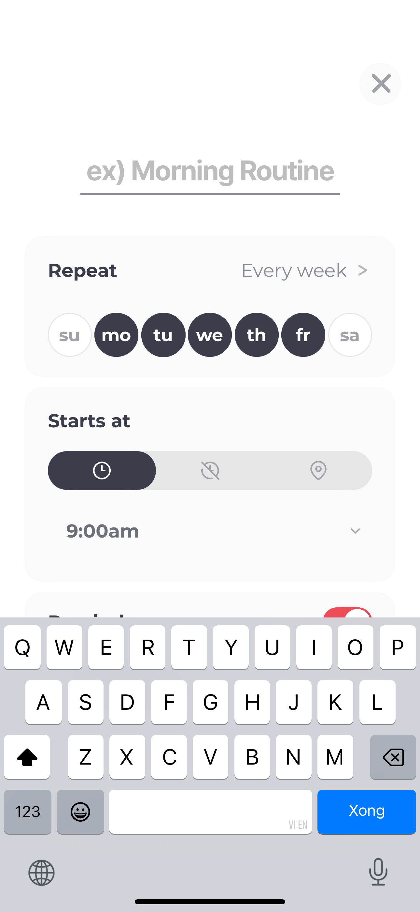
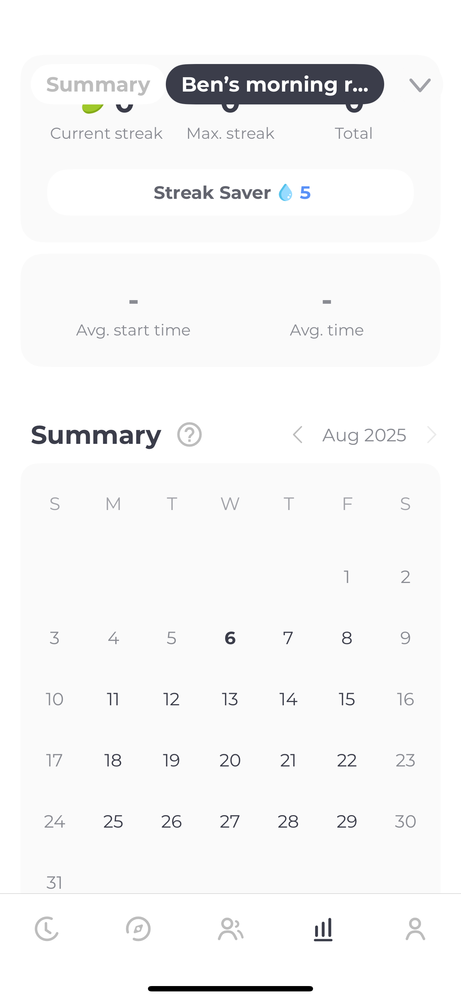

# Competitive Landscape
1. What makes Focus BEar different from these apps?
    The key to focus bear is that it combines all three: habit building, distractions blocking, and schedule into a single experience. Although the majority of the competitors concentrate on a single point (e.g. seeking distractions or providing routines), Focus Bear has incorporated: 
    - App blocking and site blocking focus modes 
    - Utilization of morning/evening routine to aid habit formation
    - Motivation and productivity nudges innately well. 
    It is especially beneficial to neurodivergent users (e.g., ADHD, autism), as it provides them with a utility that does not just reduce distractors, but actually assists in developing structure into a daily routine.
2. If you were a user, why would you choose Focus Bear over compotitors?
    If I were a user myself, the feature I would prefer in Focus Bear would be the structure of it as a guided tool to help one be productive that is not merely a blocker of distraction. As opposed to Freedom or Cold Turkey, which is more strict and does not aid you to build a habit, Focus Bear offers: 
    - Eye exercises to minimize exhaustion of decision-making
    - Custom modes to various kind of work (e.g. Deep work vs. meetings)
    - Positive reinforcement (e.g. quote inspiring or advising). 
    To an individual who needs the assistance of external structure and reminders, Focus Bear would appeal as more of a coach, than a guard.
3. What's one featire that other apps have that Focus Bear doesn't?
    Apps as Routinery and Tiimo include the calendar sync and visual timers with haptic/audio notifications. This can be a great help for individuals that require sensory input (alter and vibrate, sound cues) in order to stay focused or transition in between activities. Focus Bear still isn’t there to have that tactile/sensory cue system and doesn’t play nice with Goggle Calendar or iCal to visualize routines in-place.
4. Based on your reseatch, what's one improvement you think Focus Bear could make?
    One thing that Focus Bear can include is calendar integration as well as customization of reminders where sound/vibration can be turned on. This would:  
    - Smoothen the transition between routine blocks experienced by the users
    - Decrease the need of checking Focus Bear window manually
    - Permit more harmony with other obligations (meetings, classes, etc.). 
    This minor feature would make it a very useful time-blocking and organization tool to frequent time-blocking schedulers and power users. 
5. Personal experiment :
    I tried Routinery, which focuses on structured habit routines. I created a morning routine and scheduled it for weekdays. The app gave me visual and sensory cues to start tasks, which helped me stay on track without constantly checking my phone.
    Here is the evidences :
    
    
    