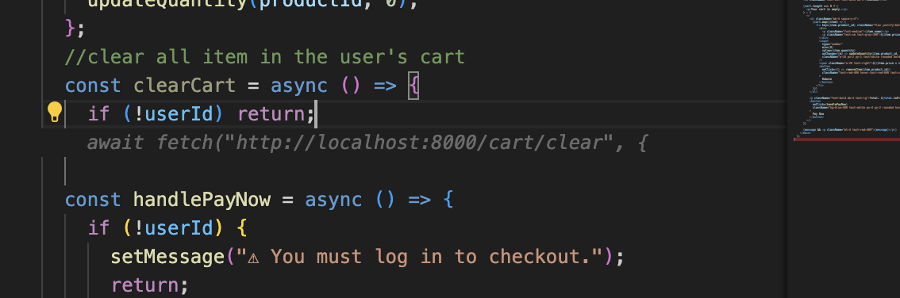

# AI tools

1. Which AI tools did you try?
   GitHub Copilot and ChatGPT
2. What worked well? What didn't?
   Worked Well
   - GitHub Copilot was showing rapid, contextual recommendations when I typed. It assisted in saving time in which one had to write similar code and boilerplate functions. It was more useful in the JavaScript and Python.
   - ChatGPT was awesome in debugging. I copied my error messages, and I obtained breakdowns of what could be wrong in details. It also made strange concepts understandable (e.g. closures in JavaScript or async/await).
     Didn't worked well
   - Copilot also made wrong or redundant suggestions in some cases, mostly when working on more complicated tasks or ones that Copilot had not yet learned.
   - I had trouble getting the AI tools to go beyond my project brief unless my instructions were very detailed.
3. When do you think AI is most useful for coding?
   - Saving the typing for boilerplate code.
   - Tackling syntax or logic issues and getting past them.
   - Acquire and practice as much new programming rules as I can.
   - Figuring out foreign lib's or API's
4. Screenshot of Experiments :
   -   
     Example: During the onboarding task, I openned an activity of mine from previous semester. Then i added a new clearCart function to my e-commerce CheckoutPage.tsx which is one of my project.
     Copilot automatically suggested checking userId before calling an API.
   -   
     Example: ChatGPT guided me through resolving a `git cherry-pick` conflict during my Git experiment.
