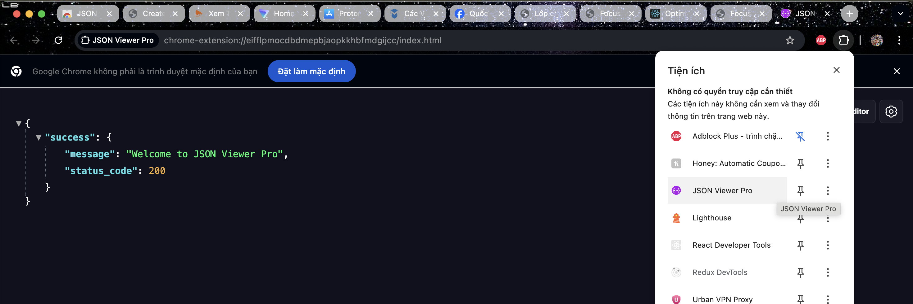

# Set Up Dev Productivity Chrome Extensions

1. Which extensions did you install? Why?
   1. React Developer Tools
   - Reason:To inspect React component hierarchy, props, and state in the browser.
   - Most Useful: Helped debug components in the Focus Bear app during development and verify state changes.
   1. Redux DevTools
   - Reason: To visualize Redux state changes and actions in real-time.
   - Most Useful: Allowed me to track dispatched actions and confirm that my reducers updated the state correctly during UI testing.
   1. Lighthouse
   - Reason: To audit website performance, accessibility, SEO, and best practices.
   - Most Useful: I ran Lighthouse audits on Focus Bear’s onboarding pages to identify performance improvements and accessibility issues.
   1. JSON View Pro
   - Reason: Since the top “JSON Viewer” extension wasn’t available in my Chrome store, I installed JSON View Pro as an alternative. It formats JSON responses in the browser, making API data easier to read.
   - Most Useful: While inspecting API responses during development, it helped me quickly verify the structure of JSON without needing an external tool.
   
   
2. What was the most useful thing you learned?
   The React Developer Tools extension is the most helpful because it shows a clear tree of components, props, and state changes.
   - Example: While testing a PR for the onboarding UI, I used React DevTools to confirm that button clicks updated the state and triggered the correct re-renders.
