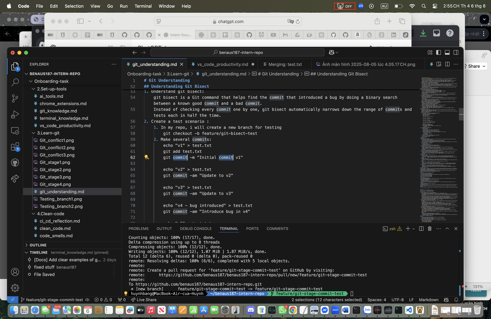

# VS code productivity

1. Top 10 shortcuts:
   - Navigation:
     1. cmd + P -> quick file navigation
     2. cmd + shift + O -> jump to a sympol in the current file
     3. control + - -> navigate Back to previous files
   - Editing: 4. cmd + D -> select next occurrence (multi-cursor) 5. option + cmd + ↑ / ↓ -> add cursor above/below 6. option + shift + ↑ / ↓ -> duplicate line up/down 7. cmd + shift + k -> delete line
   - Debugging: 8. F5 -> start debugging 9. shift + F5 -> stop debugging 10. F9 -> Toggle breakpoint
   - Terminal: 11. control + ` -> toggle intergrated terminal
2. Reflection
   - The best shortcuts:  
      The most time-saving ones are multi cursor (cmd + D, option + cmd + ↑/↓) and fast file navigation (cmd + P). They allow me to edit multiple parts of the file quickly and navigate without leaving the keyboard
   - Real-Life example :
     While editting my git_understand.md file, I noticed I used the phrase commit message multiple times. By pressing cmd+D, i could select and edit all occurrences at once.
     
   - How shortcuts improve productivity:
     - Less mousing around and context switching , which makes coding smoother.
     - Allows a quicker way of navigating code, editing and debugging across large files.
     - The exercise creates muscle memory to be efficient in increases my overall workflow.
     - Debugging shortcut like f5 and f9 help me quickly start and stop debugging sessions.
