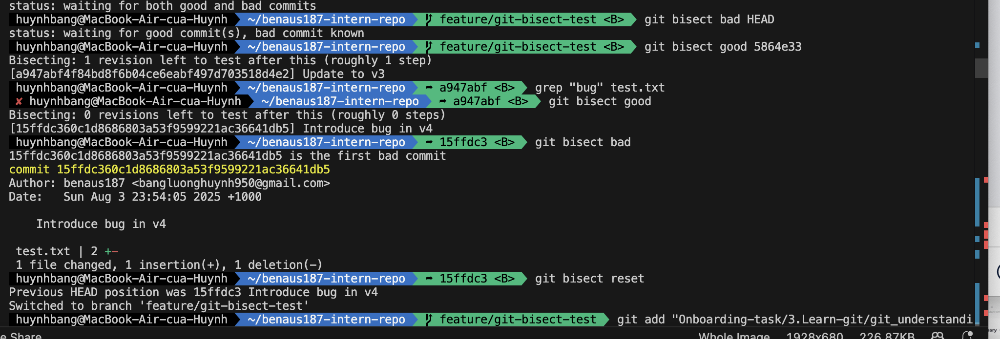
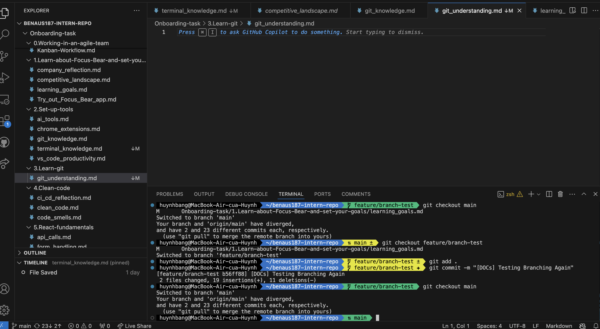

# Git Understanding 
## Pull Request 
1. Research what a Pull Request (PR) is and why it’s used ?
    A Pull Request (PR) is a mechanism in version control systems, like Git, that allows developers to propose changes to a codebase and have those changes reviewed before they are integrated into the main branch. It's essentially a formal request to "pull" changes from one branch into another, typically from a feature branch into the main or develop branch. 
2. Why are PRs important in a team workflow?
    The importance of Pull Requests (PRs) is that they:  
    - Before merging to the main branch, the team members should be allowed to review changes. 
    - Peers review to help identify bugs or errors at an early stage. 
    - Have a documented discussion on what the change is, make comments, suggestions and approvals. 
    - This keeps the main branch clean and stable by containing features or bug fixes in their own branches.
3. What makes a well-structured PR?
    An effective PR will have:  
    - Descriptive title that explains what the expected outcome is e.g., “Clean up Virtual Instances from id map” is a title in the React PR. 
    - Minute level of details description- what the PR is doing and why the change is required. 
    - Minor, narrowed down updates, which are also simpler to check and chances of disagreeing are also low.
    - Related offers or actions related or attached to the PR with other tickets or bugs. 
    - Requested reviewers- it makes sure that it is the right team members who could provide feedback.
4. What did you learn from reviewing an open-source PR?
    As demonstrated in reading the React PR (#34063):  
    - Even every minor changes, such as a memory leak fix, can be quite important though and are then reviewed.
    - The reason was it was well understood: explained by the author as: “I forgot to clean up the VirtualInstances from the id map so the Server Component instances always leaked in DEV.” 
    - PRs usually have an automated screening (CI/CD) and labels, such as CLA Signed or React Core Team to trace the acceptance mechanisms. 
    - A well-written PR is a collaboration-friendly process and this one asked to have opinionated reviewers (eps1lon and hoxyq) to provide professional input.
## Writing Meaningful Commit Message 
1. Observatiobns from React's Commit History :
    Here is some example commit from React's GitHub:
    - [Flight] Allow Temporary References to be awaited (#34084)
    - [compiler] Improve merging of scopes that invalidate together (#34049)
    - [DevTools] Clean up Virtual Instances from id map (#34063)
    These are excellent commit messages because:
    - Scoppped and tagged : It starts with a tag (e.g. [Flight], [compiler],..) which shows the part of the project affected.
    - Concise and descriptive : They quickly explain what was done without needing to open the different.
    - Traceable to discussions: It includes a PR number for review and discussion.
2. What makes a good commit message?
    A good commit message should :
    - Explain the change clearly like what was done, optionally why 
    - Be short and structured : a title under 50 characters is good enough and an additionally details in the body id needed.
    - Include context or tags like [Module] or [Feature]to indicate which part of the project is affected.
    - Link to relevant issues or PRs for easy navigation 
    Here is an example of a good commit message:
    [UI] Fix button alignment issue in mobile view (#34100)
    Adjusted CSS flex properties for buttons on small screens to ensure consistent alignment.CLOSE #34098
3. How does a clear commit message help in team collaboration?
    - EVeryone understands the purpose of the change.
    - Reviewers can quickly identify the change's intent
    - Makes git log and git blame more useful 
    - When an issue appears, you can pinpoint the exact chnage that caused it.
4. How can poor commit messages cause issues later?
    - It does not explain the change, slowing down future maintenance.
    - COde reviews take longer since reviewers have no context.
    - Debugging is harder because the commit history doesn't tell the story of why changes were made.
5. Screenshot for 3 type of test commit 

## Understanding Git Bisect
1. Understand git bisect:
    git bisect is a Git command that helps find the commit that introduced a bug by doing a binary search between a known good commit and a bad commit.
    Instead of checking every commit one by one, git bisect automatically narrows down the range of commits and tests each in half the time.
2. Create a test scenario :
    1. In my repo, i will create a new branch for testing 
        git checkout -b feature/git-bisect-test
    2. Make several commits:
        echo "v1" > test.txt
        git add test.txt
        git commit -m "Initial commit v1"

        echo "v2" > test.txt
        git commit -am "Update to v2"

        echo "v3" > test.txt
        git commit -am "Update to v3"

        echo "v4 - bug introduced" > test.txt
        git commit -am "Introduce bug in v4"

        echo "v5" > test.txt
        git commit -am "Update to v5"
    3. Decide a "bug" detection method:
        - For example, consider a bug is a file contains "bug"
        - Check with : 
        grep "bug" test.txt
3. Use git bisect to find the Bug
    1. Start git bisect :
        git bisect start
        git bisect bad  # mark current commit (with bug)
        git bisect good <commit-hash-of-known-good>
        Example: USe the hash of v2 as the last good commit 
    2. Git will automatically checkout a commit in between. Test for the bus:
        - If the bug is present : 
        git bisect bad
        From my experiment : git bisect bad HEAD
        - If the bug is not present:
        git bisect good
        From my experiment : git bisect good 5864e33
    3. Continue until Git identifies the first bad commit
    <commit-hash> is the first bad commit
    4. End the bisect session :
    git bisect reset 
    5. Screenshot from my terminal while doing the experiment:
    
    
    
### Reflection 
1. What does git bisect do?
    git bisect is a tool in Git that helps you find the commit that introduced a bug by performing a binary search through the commit history.
    - You mark one commit as good (bug-free) and one as bad (bug present).
    - Git then checks out a commit halfway between them for you to test.
    - Based on your input (git bisect good or git bisect bad), Git continues narrowing down until it finds the first commit where the bug appears.
    In my test repo, I:
    1. Created 5 commits (v1 → v5).
    2. Introduced a bug in v4.
    3. Used git bisect to identify the first bad commit.
    The real command : git bisect bad HEAD
2. When would you use it in a real-world debugging situation?
    I would use git bisect when:
    - A bug is reported in a large codebase with many commits since the last known stable version.
    - Manually reviewing each commit is too time-consuming.
    - I need to quickly isolate the exact commit that introduced a regression or unexpected behavior.
    For example:
    If a feature that worked last week suddenly breaks, and the repo had 100 commits in between, git bisect can find the first breaking commit in around 7 steps (log₂(100) ≈ 7).
3. How does it compare to manually reviewing commits?
    - Git bisect is much faster because it uses binary search instead of checking every commit one by one.
    - Manual review can be error-prone and very slow in large projects.
    - With git bisect, you just run the test and mark commits good or bad, and Git handles the search efficiently.
## Advanced git Command & when to use them 
1. Git checkout main 
    - Purpose : Restores a specific file from 'main' to the current branch without affecting other files
    - When to use : Useful for discarding changes in a single file while keeping other local edits.
    - test result : i added a temporary line to 'test.txt' and successfully restored it from 'main' using this command.
    
2. Git cherry-pick <commit> 
    - Purpose : Applies the changes from a single commit to the current branch.
    - When to use : Ideal for pulling a bug fix or small feature from another branch without merging the entire branch 
    - Test result : I created a commit on 'main' and cherry-picked it to my branch.
    
3. Git log 
    - Purpose : Displays the commit history for the branch.
    - When to use : To review changes, find commit hashes for cherry-pick, or understand project evolution.
    - Test result : I used 'git log' to visualise branches and commits.
    
4. Git blame <file>
    - Purpose : shows who last modified each line and in which commmit 
    - When yo use : to trace bugs , understand code history, or assign ownership of changes.
    - Test result : i used 'git blame test.txt' to see the commits and authors for each line, including my cherry-picked commit.
    
### Reflection 
- These commands are necessary in the case of working with several developers on the project as it provides a secure way back, it enables to apply some commits and reject others, and the presence of the clear history and the possibility to understand who did what.  
- I was surprised that 'git cherry-pick' happens to quickly show conflicts and how 'git blame' can easily indicate which set of commits in history altered each line.
- Personal Scenario:
    While working on a feature branch, I accidentally deleted a helpful comment in test.txt.
    I used git blame to find out which commit originally added that comment and who authored it.
    Then, I used git checkout main -- test.txt to restore the file to its original state without affecting my other in-progress work.
    This saved me from doing a full branch reset and losing unrelated changes.
    - Key Takeaway:
    These advanced Git commands give me control in multi-developer projects, letting me recover files, selectively apply fixes, and trace history with confidence.
## Merge Conflicts and Conflicts resolution 
### Task 
1. Creating a branch and editing a file.

2. Switching back to main, making a conflicting edit in the same file, and committing it.

3. Merging the branch back into main.

### Reflection
1. What caused the conflict?
- The conflict happened because I edited the same line in 'test.txt' on two different branches ('main' and 'feature/merge-conflict-test')
- Git couldn't automatically decide which change to keep.
2. How did you resolve it?
- I opened the file and i noticed the conflict markers.
- I made the cision to intergrate the two modifications into one line and eliminate the indicators of the conflict.
- I would then set up and commit resolved file.
3. What did you learn?
- Merge conflicts are a conflict situation that arises when two branches have edited different modifications to the same area of a file.
- Git will not able to choose which version is correct and resolve conflicts instead they have to be solved manually.
- With Git Desktop or VScode conflict can be settled with more ease since it displays clear indicators and paths.

## Branching & Team collaboration 
### Task 

### Reflection 
1. Why is pushing directly to main problematic?
    Direct pushing to main is dangerous, particularly on a group setting, since:
    - High chances of conflicts occuring: In case two or more developers are working on a certain repository and one developer pushes directly to main, this might cause his work to be merged with what others wanted to push to main.
    - No code review: Direct pushing to the main skips the pull request (PR) process and the review can be done by anyone, so bugs and errors could pass to production and no one could review them.
    - Unstable main branch: This results in unstable main, where a bug directly pushed to main will be picked up by all developers merging the newest changes and can break their local development flow.
    - Best pratice : Whenever you make changes create a new feature branch and push all the changes to this feature branch and then open a Pull Request to main as a review.
2. How do branches help with reviewing code?
    Branches can be used to enable the developer to work independently and to make the task of code review safe and simple :
    - Isolated changes: You work is isolated to branches that are not main so that the production code stays untouched until your changes are looked ar and merged into it.
    - Simple code inspections: reviews under a pull request allow reviewers to take a look at all the modifications across a branch, make comments and request modifications ahead of merging.
    - Safe experimental: Developers are not in danger of braking the main codebase by trying new features or fixes in a branch.
    - CI/CD pipeline support: Lots of teams enable automated tests to run on their branches, so their code tests are high by the time reaches the merge.
3. What happens if two people edit the same file on different branches?
    In a situation where there are two of the developers editors of the same file in distinct branches: 
    - The changes exitst independently until somebody creates a merge or a pull request.
    - When a branch is merged to main, Git will attempt to automatically merge the changes 
    - In case they have the overlap in the samelines, Git cannot make the decision on its ow of what should remain and will trigger a merge conflict.
    - The conflict has to be figured our manually by the developers, with which lines to preserve, or merge both sets of changes.
    Example:
    - File.txt line 10-update by developer A in feature-A
    - The developer B makes modification on line 10 of file.txt in feature-B
    - Assuming the first branch is merged the second branch will receive a merge conflict and the developer has to resolve it manually to run it.
## Git Concept: Staging vs. Committing
### Task
1. Experiment with adding and commiting files in your repo using either:
    - The terminal (git add/git commit)
    - A Git desktop client (e.g., GitHub Desktop, VS Code Git integration).
2. Modify a file and try the following:
    - Stage it but don’t commit (git add <file> or equivalent in your client).
    
    - Check the status (git status).
    
    - Unstage the file (git reset HEAD <file> or equivalent).
    
    - Commit the file and observe the difference
    
### Reflection
1. What is the difference between staging and committing?
    - Staging (git add) will transfer the altered files to the staging area which is a staging ground where you arrage precisely what you want to be commited in the next commit.
    - The operation of committing (git commit) is what saves all the staged changes permanently in the history of the repository as a unique commit ID.
    - An example in my experiment:
        - Once staged test.txt, it appeared in green and ready to be committed to the respository on git status.
        - The changes only entered the Git history once Git run command git -m " Experiment: Demonstrate the different between staging and committing".
2. Why does Git separate these two steps?
    - It has the ability to do selective commits: you may adjust many files but only commit part of them 
    - It is flexible and safe, being able to examine, preview or reserve changes (git reset HEAD <file>) prior to committing them.
    - Allows efficient, rational commits: you can actually structure your changes into meaningful commits as opposed to pushing in "whatever".
3. When would you want to stage changes without committing?
    - When you are deploying larger features and you need/feel you want to stash-off a partial work but still goinf to edit and complete what you need to do before committing.
    - When reviewing code, in order to ready the changes towards a clean commit that only incorporates the right amount of changes. 
    - I have tested by staging test.txt and running; git status asking to make sure that what has been staged was correct and then committed.