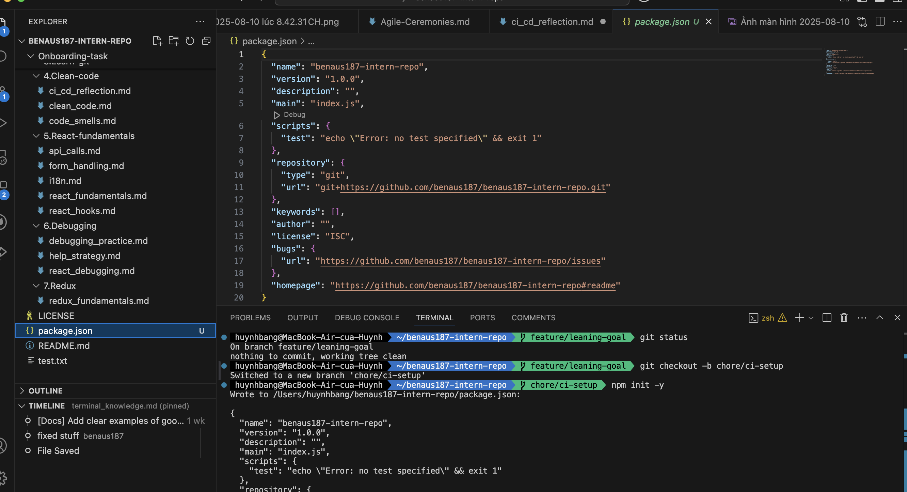
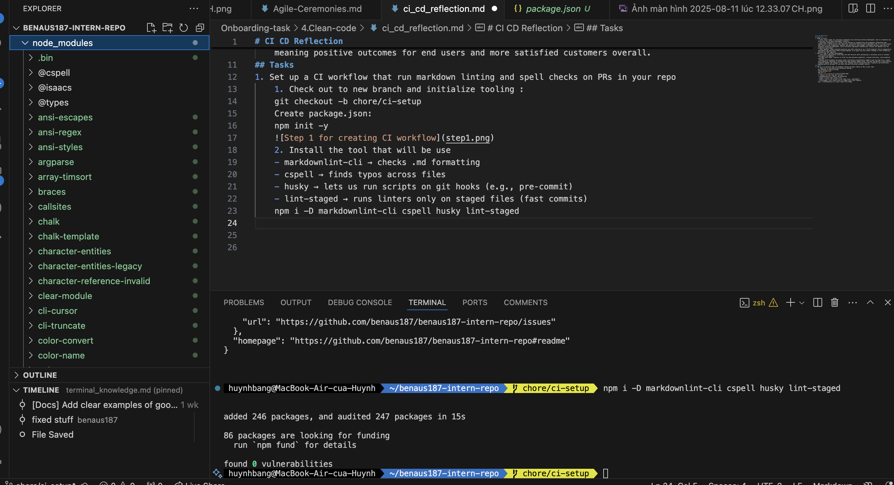
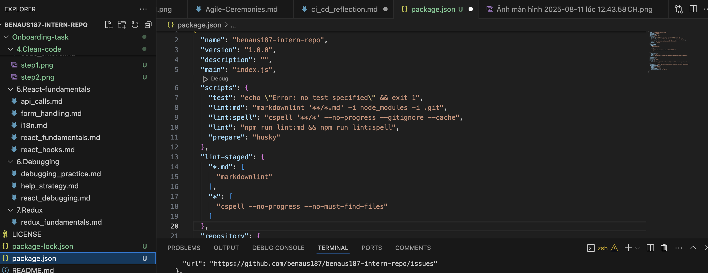
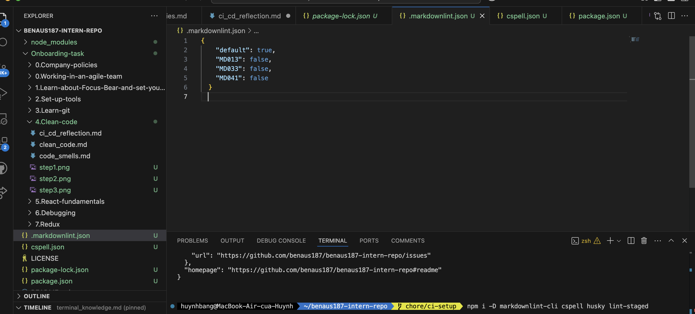
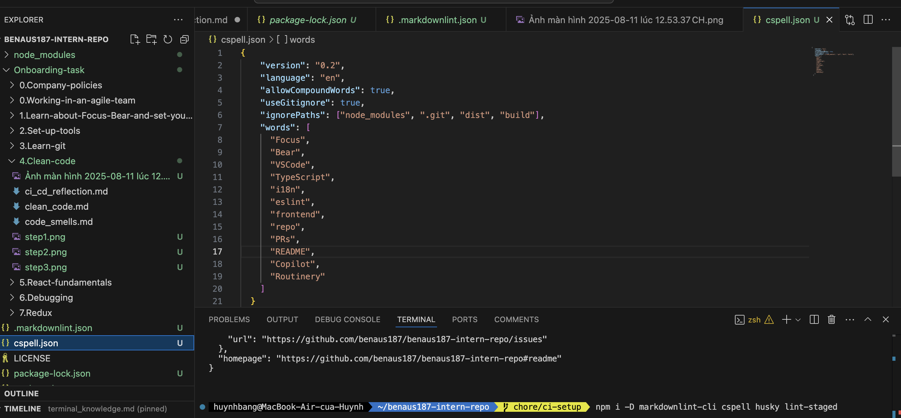
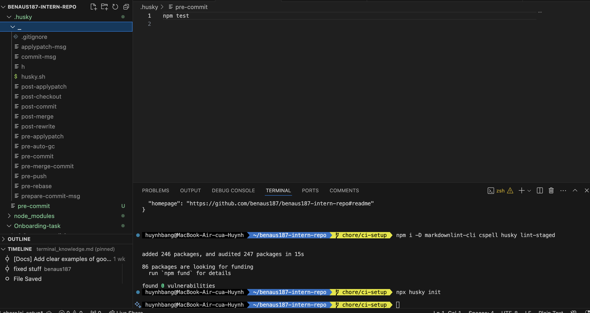
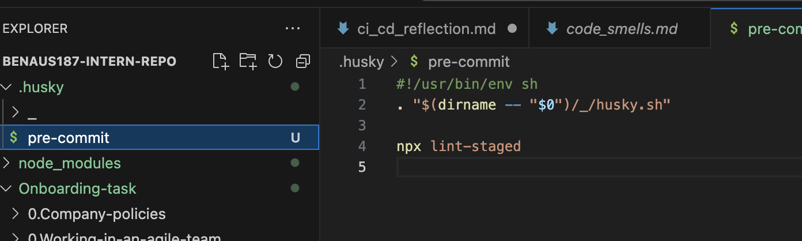
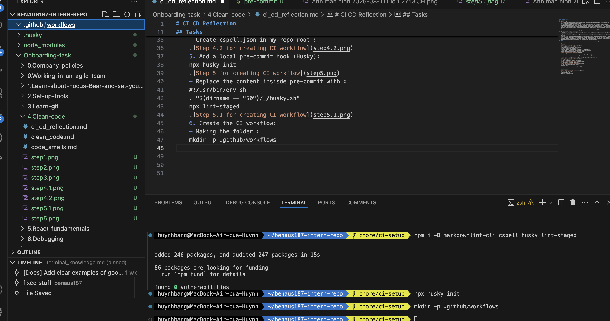
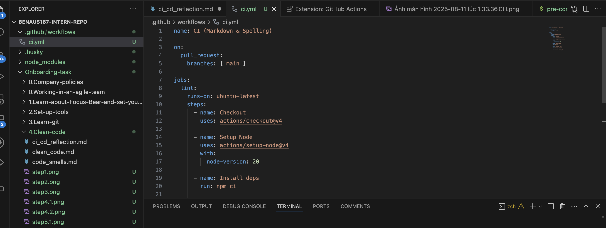
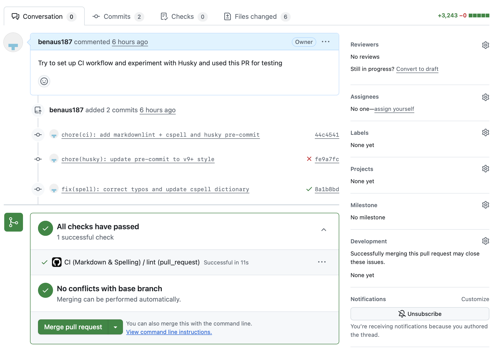

# CI CD Reflection

## Research

1. What is CI/CD?
    - CI/CD, which stands for continuous integration and continuous delivery/deployment, aims to streamline and accelerate the software development lifecycle.  
    - Continuous integration (CI) refers to the practice of automatically and frequently integrating code changes into a shared source code repository. Continuous delivery and/or deployment (CD) is a 2 part process that refers to the integration, testing, and delivery of code changes. Continuous delivery stops short of automatic production deployment, while continuous deployment automatically releases the updates into the production environment.
    - Taken together, these connected practices are often referred to as a "CI/CD pipeline" and are supported by development and operations teams working together in an agile way with either a DevOps or site reliability engineering (SRE) approach.
2. Why it's used in software development?
    - CI/CD helps organizations avoid bugs and code failures while maintaining a continuous cycle of software development and updates.
    - As apps grow larger, features of CI/CD can help decrease complexity, increase efficiency, and streamline workflows.
    - Because CI/CD automates the manual human intervention traditionally needed to get new code from a commit into production, downtime is minimized and code releases happen faster. And with the ability to more quickly integrate updates and changes to code, user feedback can be incorporated more frequently and effectively, meaning positive outcomes for end users and more satisfied customers overall.

## Tasks

1. Set up a CI workflow that run markdown linting and spell checks on PRs in your repo
    1. Check out to new branch and initialize tooling :
    git checkout -b chore/ci-setup
    Create package.json:
    npm init -y
    
    1. Install the tool that will be use
    - markdownlint-cli → checks .md formatting
    - cspell → finds typos across files
    - husky → lets us run scripts on git hooks (e.g., pre‑commit)
    - lint-staged → runs linters only on staged files (fast commits)
    npm i -D markdownlint-cli cspell husky lint-staged
    
    1. Add script so we can run the tools
    - lint:md → run markdownlint on every .md (ignoring heavy folders)
    - lint:spell → run cspell across the repo (uses .gitignore to skip stuff)
    - lint → convenience command that runs both
    - prepare → special npm script: runs after install to set up Husky
    - lint-staged → tells Husky what to check only for staged files at commit time
    
    1. Configure the linters
    - Create .markdownlint.json in my repo root :
    
    - Create cspell.json in my repo root :
    
    1. Add a local pre-commit hook (Husky):
    npx husky init
    
    - Replace the content inside pre-commit with :
    #!/usr/bin/env sh
    . "$(dirname -- "$0")/_/husky.sh"
    npx lint-staged
    
    1. Create the CI workflow:
    - Making the folder :
    mkdir -p .github/workflows
    
    - Create .github/workflows/ci.yml with the content inside :
    
    1. Make a branch, commit and push the setup :
    

### Reflection

1. What is the purpose of CI/CD?
    CI/CD stands for Continuous Intergration and Continuous Delivery/Deployment
    - Continuous Intergration: Every commit, code is built and tested. This assists in identifying bugs at a very early stage before the production stage.
    - Continuous Delivery/Deployment: Code changes need to have only minimal operator intervention after testing in order to get deployed into staging or production environments via automation.
    Purpose :
    - Catch problems when and where you can detect them.
    - Have code that is deployable make sure maintenance is painless.
    - Decrease intergration issues.
    - Be more efficient and reliable with the updates delivered.
2. How does automating style checks improve project quality?
    Enforcing style checks through automation (such as by Markdown linting and by spell checking) provides:
    - Consistency: There is a style of code and documentation which is consistent so easier to read and maintain consistency.
    - Error Prevention: Spelling and copying mistakes, the wrong formatting, and style violations are eliminated in the preceding of the merge.
    - Efficiency: Code review requires the developers to spend less time considering the formatting problems as they would do during the code review, but look at the functionality and logic.
    - Professionalism: Coding and records look neat and up-to-date to both internal staff and external stakeholders.
3. What are some challenges with enforcing checks in CI/CD?
    - Developer Frustration: Checks may be so restrictive or unclear that they hamper progress, and make developers angry.
    - False Positives: Other times the automated tools mark things that are technically acceptable and then time will be wasted/lost trying to correct something that was never a problem in the first place.
    - Setup and Maintenance: A CI/CD pipeline and linting require setting up and continual updates with codebase and tool changes.
    - Performance: Computing a check on each commit or PR may be performance prohibitive unless it is optimized.
4. How do CI/CD pipelines differ between small projects and large teams?
    Small Projects :
    - Less complex pipeline with less stages (e.g. lint+test+deploy).
    - Fewer branches of complexity; tends to directly push or little PRs.
    - Less cumbersome to jog and to service.
    Large Team :
    - More complicated pipelines that have more than one stage (e.g. build,lint,test,intergration tests, security scans, deploy).
    - Several environments (dev, staging, production) where approvals must be given before getting the code into production.
    - Increasing the use of caching, parallel jobs and artifacts storage to accelerate builds.
    - The rigid application of the coding norms in the name of consistency with a multitude of contributors.
