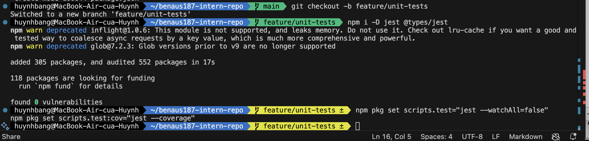
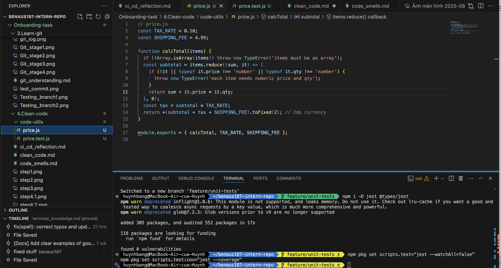
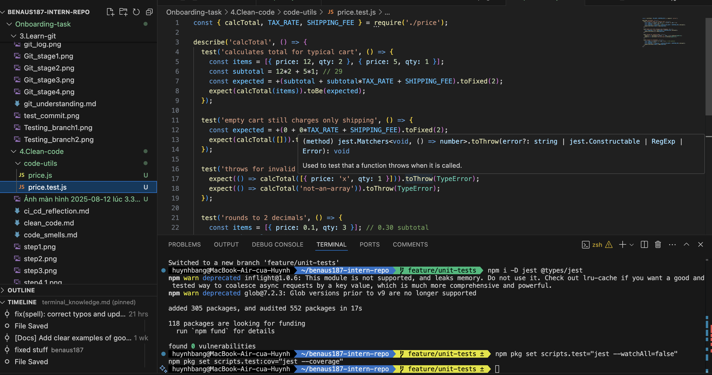
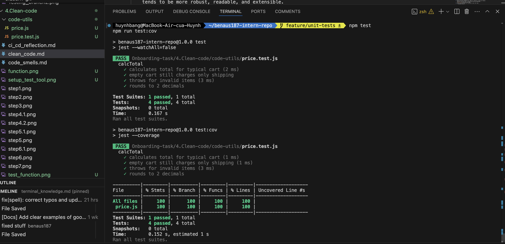
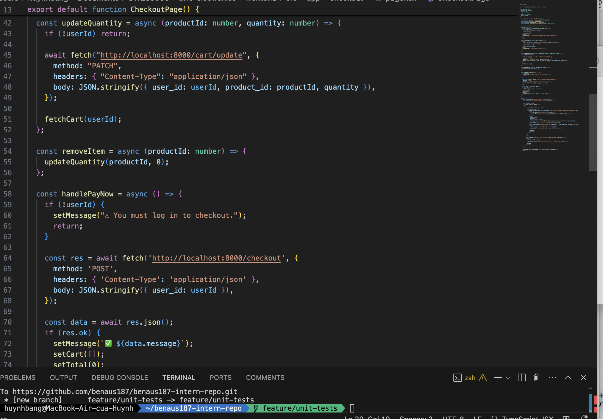
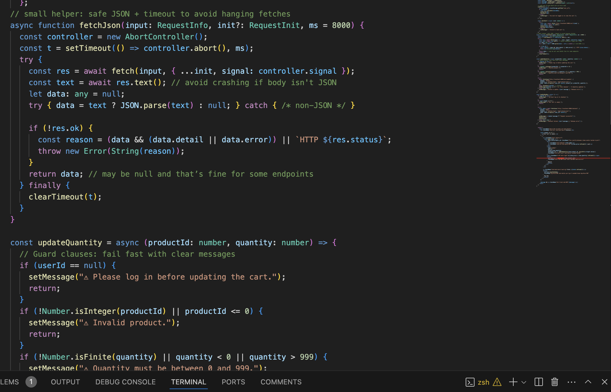
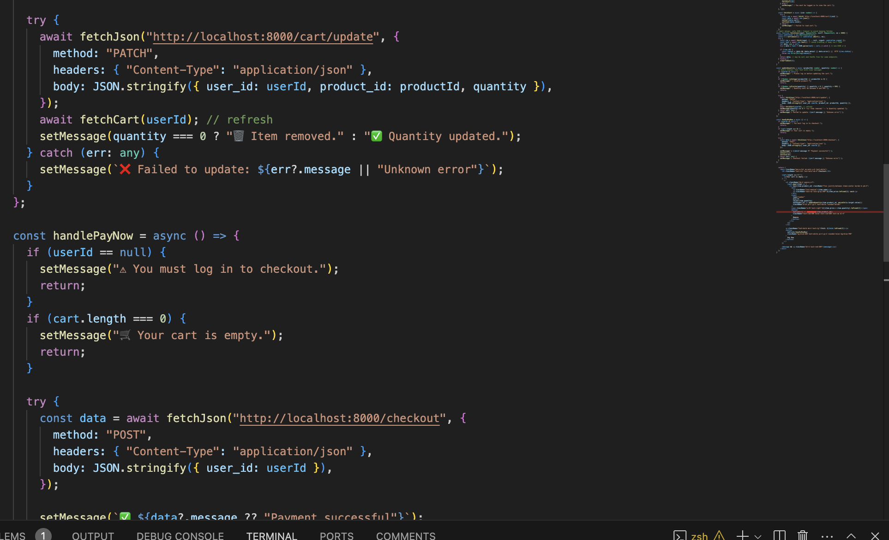

# Clean Code

## Writing Unit Test for Clean Code

### Tasks - Unit test

1. Researching the importance of unit testing in software development.
    - Unit  testing  stands  as  a  cornerstone  of  modern  software  development  practices,  offering developers a systematic approach to ensure the correctness, reliability, and maintainability of their  code.  This  article  delves  into  the  significance  of  unit  tests  in  software  development, exploring their benefits, principles, best practices, and their transformative impact on the quality and agility of software projects.
    - The Importance of Unit Tests:
    Unit  tests  are  small,  automated  tests  designed  to  validate  the  behavior  of  individual  units  or components  of  code  in  isolation. By  isolating  units  of  code  and  testing  them independently, developers  can  identify  defects  early  in  the  development  cycle,  reduce debugging  time, and enhance code quality.
    The importance of unit tests can be summarized as follows:
    1. Early Bug Detection: Unit tests enable developers to catch bugs and regressions early in the development process, preventing them from propagating to subsequent stages and minimizing the cost of fixing defects.
    1. Code Confidence: Writing unit tests instills confidence in the correctness and behavior of code, allowing developers to make changes and refactor code with assurance that existing functionality remains intact.
    1. Improved Code  Quality:  Unit tests  promote  clean, modular,  and  maintainable code  by enforcing  design  principles  such  as  encapsulation,  loose  coupling,  and  single responsibility. Well-tested code tends to be more robust, readable, and extensible.
    1. Documentation: Unit tests serve as living documentation for code, providing executable specifications that describe the intended behavior of individual units. They enhance code comprehension and facilitate knowledge transfer among team members.
2. Choose a testing framework (e.g., Jest for JavaScript, PyTest for Python).
    Deciced to go with Jest for JavaScript with this experiment :
    
3. Write a few unit tests for a function in your test repo.
    - Creating function :
    
    - Creating Unit Test:
    
    - Result of testing:
    

### Reflection - Unit Test

1. How do unit test help keep code clean?
    - Protect behavior: When I refactor (e.g., change rounding), tests guard against accidental breakage.
    - Design pressure: Writing tests pushed me to validate inputs and split logic (subtotal, tax) clearly.
    - Documentation: Tests show expected use (valid arrays), edge cases (empty cart), and failure modes (invalid items).
2. What issues did you find while testing ?
    - I initially forgot to validate input shapes; tests for invalid items failed -> added `TypeError` checks.
    - Floating point precision needed explicit rounding to two decimals.
3. Takeaways
    - Small, focused tests catch real bugs early (type errors, rounding).
    - Clear contracts (throw on bad input) make the function safer to reuse

## Handling Errors & Edge Cases

### Task - handling error

1. Research strategies for handling errors and edge cases in code (include Guard Clauses)
    - A guard clause is a technique derived from the fail-fast method whose purpose is to validate a condition and immediately stop the code execution if the condition is not met by throwing a meaningful error instead of leaving the program to throw a deeper and less meaningful error.
    - Code quality assumes a hard challenge of considering very many scenarios, especially with edge cases and error handling. When working with Copilot or coding manually, it is important for the developer to think of solutions meant to accept expected inputs and unexpected ones. That includes error handling, edge case processing, and general robustness of the code.
    - There are few steps to work through to ensuring suggestions include edge cases and error handling:
    1. Identify common edge case.
    2. Leverage defensive programming pratices.
    3. Improve error handling mechanism.
    4. Test for edge cases.
    5. Refine suggestions using linting and code review.
2. Find an existing function that doesn't properly handle errors or invalid inputs
    Here is one of the function from my previous application :
    
    Problems:
    - No validation for productId/quantity (NaN, negative, huge values).
    - No network error handling (fetch failures throw and crash the event handler).
    - Assumes response is always JSON.
    - No early user feedback (spinner/disable) if the request is in-flight.
3. Refactor the function to improve error handling
    Here is the code after refactoring :
    
    

### Reflection - handling error

1. What was the issue with the original code?
    - Bug in original code: updateQuantity and handlePayNow made the assumptions that input was good and the network calls was successful. They did not validate quantity/product IDs, did not detect network errors and added the assumption that the response was always JSON. That might lead to crashes or silent failures that have confusing UX.
    - The changes to what I made: I introduced guard clauses to scrutinize the input and terminate with a clear message early. I then wrapped network calls in a try/catch, and included a little fetchJson helper with a timeout and safe JSON parsing and then showed informative error messages to the user.
2. How does handling errors improve reliability ?
    - How this increases reliability: Guard clauses ensure that happy‑path code remains uncluttered and that invalid states cannot occur sooner. Effective error catching will avoid crashing, provide a user with immediate, actionable feedback, and is also easier to debug/break down (ex: HTTP status vs invalid JSON vs, timeout).
    - Outcome: The module now fails quickly when given bad input, it gracefully recovers after some network problems and gives predictable messages- which make it more robust and the user more willing to trust it.

## Commenting & Documentation

### Tasks - Commenting

1. Research best practices for writing comments and documentation.
    - Explain the “why”, not the “what”: Code shows what it does; comments capture intent, trade‑offs, links to tickets/specs, and non‑obvious constraints.
    - Document contracts: Inputs/outputs, error cases, units, invariants, side effects, performance assumptions.
    - Keep comments close to code and update them when code changes (stale comments are worse than none).
    - Prefer self‑documenting code: good names, small functions, clear types; add comments only where names can’t carry the meaning.
    - Use consistent format: JSDoc (TS/JS), docstrings (Python), etc. Include examples for tricky functions.
    - Flag surprises: workarounds, TODOs with owner + issue link, security/privacy caveats.
2. Find and example of poorly commented code and rewrite the comments to be more useful
    - Example of poorly commented code :
        // increase x
        // loop stuff
        function calc(a: number, b: number) {
        let x = a + b
        for (let i = 0; i < 100; i++) {
            x += i
        }
        return x // return result
        }
    - Rewrite the comments to be more useful :
        /**
            Computes a base sum and adds a triangular offset.
            Why:
            - Used by the budgeting screen to apply a fixed offset equal to sum(0..N-1).
            Contracts:
            - a, b are integers (can be negative).
            - N defaults to 100; change with env var `OFFSET_N` if needed.
        */
            export function sumWithOffset(a: number, b: number, N = Number(process.env.OFFSET_N ?? 100)) {
            const base = a + b
            // Triangular number T_(N-1) = N*(N-1)/2 (faster than a loop)
            const offset = (N * (N - 1)) / 2
            return base + offset
            }

### Reflection - Commenting

1. When should you add comments?
    - Non-obvious intent or domain rules ("VAT applies only if ...").
    - Workarounds/tech debt with a link to an issue (e.g. //TODO(owner): fix#123).
    - Security, performance, or numerical vaceats (e.g., rounding, timezone).
    - Public or shared APIs (parameters, return values, error modes, examples).
2. When should you avoid comments and instead improve the code?
    - When a better name or smaller function makes the comment redundant.
    - When the comment repeats code ("increment i by 1").
    - WHen comments would mask a design smell-refactor first.

## Refactoring Code for Simplicity

### Task - refactoring code

1. Research common refactoring techniques.

- There are 7 code refactoring techniques in Software Engineering:
    1. Red-Green Refactoring.
    2. Refactoring by Abstraction.
    3. Composing Method.
    4. Simplifying Methods.
    5. Moving Features between Objects.
    6. Preparatory Refactoring.
    7. User Interface Refactoring.

1. Find an example of overly complicated code in an existing project (or write your own)
    // cart-old.js
        function checkout(cart, taxRate, discountCode) {
        let total = 0;
        for (let i = 0; i < cart.length; i++) {
            const item = cart[i];
            if (!item || !item.price || !item.quantity) continue; // silent skip
            total += item.price*item.quantity;
        }
        // discount + tax mixed together
        if (discountCode === 'WELCOME10') total*=0.9;
        if (discountCode === 'VIP20') total*=0.8;
        const tax = total*(taxRate || 0.1);
        total += tax;
        return '$' + total.toFixed(2);
        }
1. Refactor it to make it simpler and more readable
    // cart.js
        /**
        *@typedef {Object} CartItem
        *@property {number} product_id
        *@property {string} name
        *@property {number} price
        *@property {number} quantity
        */

        /** Guard: validate one item */
        function validateItem(item) {
        if (!item) throw new Error('Item is required');
        if (typeof item.price !== 'number' || item.price < 0) {
            throw new Error(`Invalid price for ${item.name || 'item'}`);
        }
        if (!Number.isInteger(item.quantity) || item.quantity < 0) {
            throw new Error(`Invalid quantity for ${item.name || 'item'}`);
        }
        }

        /** Pure: line total */
        function lineTotal(item) {
        validateItem(item);
        return item.price * item.quantity;
        }

        /** Pure: sum of line totals */
        function cartSubtotal(cart) {
        if (!Array.isArray(cart)) throw new Error('Cart must be an array');
        return cart.reduce((sum, it) => sum + lineTotal(it), 0);
        }

        /** Pure: apply known discounts */
        function applyDiscount(subtotal, code) {
        const codes = {
            WELCOME10: 0.10,
            VIP20: 0.20,
        };
        const pct = codes[code] || 0;
        return subtotal * (1 - pct);
        }

        /** Pure: tax */
        function calcTax(amount, taxRate) {
        const rate = typeof taxRate === 'number' ? taxRate : 0.10;
        if (rate < 0) throw new Error('Tax rate cannot be negative');
        return amount * rate;
        }

        /** Format money */
        function formatCurrency(n) {
        return `$${n.toFixed(2)}`;
        }

        /**
        * End-to-end calculator (still pure)
        * @param {CartItem[]} cart
        * @param {Object} opts
        * @param {number} [opts.taxRate]
        * @param {string} [opts.discountCode]
        */
        function calculateTotal(cart, { taxRate, discountCode } = {}) {
        const subtotal = cartSubtotal(cart);
        const discounted = applyDiscount(subtotal, discountCode);
        const tax = calcTax(discounted, taxRate);
        const grandTotal = discounted + tax;

        return {
            subtotal,
            discounted,
            tax,
            total: grandTotal,
            display: formatCurrency(grandTotal),
        };
        }

        // Example usage:
        const cart = [
        { product_id: 1, name: 'Notebook', price: 4.5, quantity: 3 },
        { product_id: 2, name: 'Pen',      price: 1.2, quantity: 5 },
        ];

        try {
        const result = calculateTotal(cart, { taxRate: 0.1, discountCode: 'WELCOME10' });
        console.log(result.display); // -> "$14.58" (example)
        } catch (err) {
        console.error('Checkout error:', err.message);
        };

### Reflection - refactoring code

1. What made the original code complex?
    The initial code had all sorts of problems that rendered it difficult to maintain:
    - Long function has split duties.
    - Deeply nested conditionals that made the conditionals very difficult to read.
    - Redundant code in two locations.
    - Strings and magic numbers which complicated the reading of the code.
    - Lack of sufficiently split concerns, where all the UI logic, calculations and data manipulation are the same function.
    This complicated debugging, the likelihood of the bugs during change, and the slowness of development.
2. How did refactoring improve it?
    - Readability: Functions were smaller with pertinent names and the flow of text more consumable.
    - Maintainability: It is possible to make changes only staying at one point and keep them not related.
    - Testability: The ability to test units within logic in a more focused manner, this became much easier because it was divided into smaller units.
    - Scalability: Being able to have a neat division between UI and business logic eases the work of extending the app.

## Avoiding Code Duplication

### Task - code duplication

1. Research the "Don't Repeat Yourself" (DRY) principle.
    "Don't Repeat Yourself" (DRY) is a software development principle that encourages developers to avoid duplicating code in a system.
    - When developers adhere to the DRY principle, they aim to create reusable components, functions, or modules that can be utilized in various parts of the codebase.
    - This not only makes the code more maintainable but also minimizes the chances of errors since changes or updates only need to be made in one location.
    - DRY is closely related to the concept of modular programming and the creation of functions, classes, or modules that encapsulate specific functionality.
    - An alternative principle, the Single Responsibility Principle or SRP, is often mentioned in conjunction with DRY. SRP suggests that a module, class, or function should have only one reason to change, further emphasizing the need for focused, modular, and reusable code.
    - Together, DRY and SRP contribute to creating more robust and maintainable software systems.
2. Find a section of code in you test repo with unnecessary repetition.
    // cart-old-a.js
        function lineTotal(item) {
        return item.price*item.quantity; // duplicated here
        }

        // cart-old-b.js
        function calcOrderTotal(cart) {
        let total = 0;
        for (const it of cart) {
            total += it.price*it.quantity; // duplicated again
        }
        return total;
        }
3. Refactor the code to eliminate duplication.
    - Create a small utility module and reuse it.
    // src/utils/money.js
        export function lineTotal(item) {
        if (!item || typeof item.price !== 'number' || !Number.isInteger(item.quantity)) {
            throw new Error('Invalid cart item');
        }
        return item.price * item.quantity;
        }

        export function cartTotal(cart) {
        if (!Array.isArray(cart)) throw new Error('Cart must be an array');
        return cart.reduce((sum, it) => sum + lineTotal(it), 0);
        }
    - Refactor callers to import the shared functions:
    // cart-a.js
        import { lineTotal } from './src/utils/money.js';
        export function subtotal(items) {
        return items.reduce((s, it) => s + lineTotal(it), 0);
        }

        // cart-b.js
        import { cartTotal } from './src/utils/money.js';
        export function grandTotal(cart, taxRate = 0.1) {
        const base = cartTotal(cart);
        return base + base * taxRate;
        }

### Reflection - code duplication

1. What were the issues with duplicated code?
    - I found the same price × quantity calculation in multiple files (`cart-old-a.js`, `cart-old-b.js`).  
    - Each copy lacked consistent validation, so some paths accepted invalid data (e.g., non‑numeric `price`).  
    - Any bug fix or change (like updating tax rules or rounding) would require editing several places, risking drift and new bugs.
2. How did refactoring improve maintainability?
    - I extracted `lineTotal` and `cartTotal` into a single utility module (`src/utils/money.js`).  
    - Now all callers share the same validation and logic, so fixes happen nce.  
    - Readability improved (call sites read like intent: `cartTotal(cart)`), and test coverage is simpler and stronger.  
    - Future changes (currency formatting, rounding rules, discounts) can be made centrally without hunting duplicates.

## Writing Small, Focused Functions

### Task - small, focused functions

1. Research best practices for writing small, single-purpose functions.
    - One reason to change: each function does one job (SRP).
    - Clear inputs/outputs: pure when possible (no I/O or globals).
    - Short: aim to fit on one screen; ~5–20 lines is a good gut check.
    - Good names > comments: applyDiscount says more than a comment in doEverything.
    - Composability: small pieces are easy to test and reuse.
2. Find an example of a long, complex function in an existing codebase (or write your own).
    // order-old.js
        export async function processOrder(order, user, opts = {}) {
        // 1 Validate
        if (!order || !Array.isArray(order.items) || order.items.length === 0) {
            throw new Error("Invalid order");
        }
        if (!user || !user.email) throw new Error("Missing user");

        // 2 Subtotal
        let subtotal = 0;
        for (const it of order.items) {
            if (!it || typeof it.price !== "number" || !Number.isInteger(it.qty)) continue;
            subtotal += it.price * it.qty;
        }

        // 3 Discount
        let discountPct = 0;
        if (opts.code === "WELCOME10") discountPct = 0.1;
        if (opts.code === "VIP20") discountPct = 0.2;
        const discounted = subtotal * (1 - discountPct);

        // 4 Tax
        const rate = typeof opts.taxRate === "number" ? opts.taxRate : 0.1;
        const tax = discounted * rate;

        // 5 Total & receipt
        const total = discounted + tax;
        const receipt = `Total: $${total.toFixed(2)} (subtotal $${subtotal.toFixed(
            2
        )}, tax $${tax.toFixed(2)})`;

        // 6 Persist (fake)
        await fakeDbSave({ userId: user.id, order, total });

        // 7 Notify (fake)
        await fakeEmail(user.email, "Your receipt", receipt);

        return { subtotal, discounted, tax, total, receipt };
        }
3. Refactor it into multiple smaller functions with clear responsibilities.
    // order.js
        export function validateOrder(order, user) {
        if (!order || !Array.isArray(order.items) || order.items.length === 0) {
            throw new Error("Invalid order: missing items");
        }
        if (!user || !user.email) throw new Error("Invalid user");
        }

        export function lineTotal(item) {
        if (!item || typeof item.price !== "number" || !Number.isInteger(item.qty)) {
            throw new Error("Invalid item");
        }
        return item.price * item.qty;
        }

        export function subtotal(items) {
        return items.reduce((sum, it) => sum + lineTotal(it), 0);
        }

        export function applyDiscount(amount, code) {
        const table = { WELCOME10: 0.1, VIP20: 0.2 };
        const pct = table[code] ?? 0;
        return amount * (1 - pct);
        }

        export function tax(amount, taxRate = 0.1) {
        if (taxRate < 0) throw new Error("Tax rate cannot be negative");
        return amount * taxRate;
        }

        export function formatReceipt({ subtotal, discounted, tax, total }) {
        return `Total: $${total.toFixed(2)} (subtotal $${subtotal.toFixed(
            2
        )}, tax $${tax.toFixed(2)})`;
        }

        // Ports (side effects) kept thin & swappable
        export async function saveOrder(db, payload) {
        return db.save(payload);
        }

        export async function sendReceipt(emailer, to, subject, body) {
        return emailer.send(to, subject, body);
        }

        // Orchestrator: wires pure pieces + side effects
        export async function processOrder(order, user, opts, { db, emailer }) {
        validateOrder(order, user);

        const sub = subtotal(order.items);
        const disc = applyDiscount(sub, opts?.code);
        const t = tax(disc, opts?.taxRate ?? 0.1);
        const total = disc + t;
        const receipt = formatReceipt({
            subtotal: sub,
            discounted: disc,
            tax: t,
            total,
        });

        await saveOrder(db, { userId: user.id, order, total });
        await sendReceipt(emailer, user.email, "Your receipt", receipt);

        return { subtotal: sub, discounted: disc, tax: t, total, receipt };
        }

### Reflection - small, focused functions

1. Why is breaking down functions beneficial?
    - Clarity: The functions are only responsible of one task and a clear name, hence, intent is evident since there is no reading of the body.
    - Testability: Pure, small functions (e.g. subtotal, applyDiscount, tax) can be easily unit-tested in isolation.
    - Reusability: logic is shared and common, and no duplication is made.
    - Invariant safety: Behavior can change (such discount rules) without editing a large, complicated function that combines validation, calculation and I/O.
    - Separation of concerns: The business rules and side effects are explicitly separated and they are now easier.
2. How did refactoring improve the structure of the code?
    - I broke out a large `processOrder` routine into tiny functions: `validateOrder`, `lineTotal`, `subtotal`, `applyDiscount`, `tax`, `formatReceipt` and slim ports (`saveOrder`, `sendReceipt`).
    - These pieces are written by the new orchestrator and the flow is simple to avoid scan.
    - Failure to pass tests implies exactly where to blame (math or formatting or I/O), since failures are aimed at the pure functions.
    - New discount codes, varying tax rates, several currencies, etc., can be added in the future via editing or swapping small units rather than hacking on a monolith.

## Naming Variables & Functions

### Task - naming

1. Research best practices for naming variables and functions.
    - Choose meaningful names
    - The length of a name
    - Choose searchable names
    - Avoid negative names
    - Don’t use prefixes
    - Choose names that you can pronounce
    - Be careful with optical illusions
    - Make meaningful distinction between names
2. Find examples of unclear variable names in an existing codebase (or write your own).
    // cart-utils-old.js
        export function calc(a, b, c) {
        // a: items, b: discount code, c: tax rate
        let s = 0;
        for (const x of a) {
            s += x.p*x.q;   // p = price, q = quantity
        }
        if (b === 'WELCOME10') s*= 0.9;
        if (b === 'VIP20') s*= 0.8;
        return s+s*(c ?? 0.1);
        }
3. Refactor the code by renaming variables/functions for better clarity.
    // cart-utils.js
        /**
        *Calculate a cart total after discount and tax.
        *@param {{price:number, quantity:number}[]} items
        *@param {string} discountCode
        *@param {number} [taxRate=0.1]
        */
        export function calculateCartTotal(items, discountCode, taxRate = 0.1) {
        const subtotal = items.reduce((sum, item) => sum+item.price*item.quantity, 0);

        const discountMap = { WELCOME10: 0.10, VIP20: 0.20 };
        const discountPct = discountMap[discountCode] ?? 0;
        const discounted = subtotal*(1-discountPct);

        const total = discounted+discounted*taxRate;
        return total;
        }

### Reflection - naming

1. What makes a good variable or function name?
    - Descriptive and precise: the name communicates purpose without reading the implementation (e.g., `calculateCartTotal`, `discountCode`, `taxRate`).
    - Consistent with domain: use business terms such as `subtotal`, `lineTotal`, `receipt`.
    - Action‑oriented for functions: verb + object (`applyDiscount`, `saveOrder`).
    - Readable booleans: `isEmpty`, `hasItems`, `shouldRetry`.
    - Appropriate scope length: short names for tiny local scope; full names for broader scope.
    - No unnecessary abbreviations or noise words: avoid `a`, `b`, `obj`, `data` unless truly clear.
2. What issues can arise from poorly named variables?
    - Bugs from wrong assumptions (e.g., mixing up `price` vs `priceCents`).
    - Harder onboarding: new contributors have to reverse‑engineer intent.
    - Fragile code reviews: reviewers miss issues because names hide meaning.
    - Low reusability: unclear functions don’t invite safe reuse.
    - Comment debt: code needs extra comments to explain vague names.
3. How did refactoring improve code readability?
    I replaced vague names in a cart calculator:
    - `calc(a, b, c)` became `calculateCartTotal(items, discountCode, taxRate)`.
    - Temporary `s` became `subtotal`, then `discounted`, then `total`.
    - Item fields `p` and `q` became `price` and `quantity`.
    - Added a `discountMap` to make discount rules explicit.
