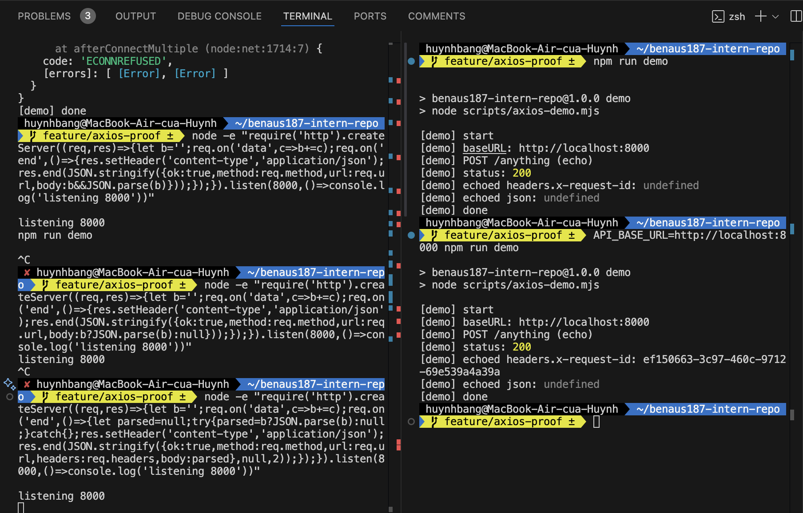

# Making API Calls with Axios

## Tasks

1. Research how Axios works and why it's commonly used for API calls.

2. Set up an Axios instance with the following requirement.

- A base URL for API requests.
- Default headers (including accept: "*/*" and a dynamically generated request ID).
- Request timeouts to prevent hanging requests.
- Request cancellation using AbortController.

1. Add an Axios request interceptor that.

- Retrieves an authentication token from local storage.
- Attaches the token to the request headers if available.
- Properly handles errors.

1. Make a test API request that.

- Sends a POST request to an endpoint with parameters.
- Handles the response and redirects if necessary.

## Reflection

1. Why it is useful to create a reuseable Axios instance?
Axios instances can be reused that offers a unified and one-stop-shop access point to configure defaults like the base URL, headers, and timeouts. This implies that all the requests automatically use the same configuration and this eliminates duplication and possibility of inconsistent settings in the codebase. It also makes worldwide changes less tedious (ex: a base URL of the API was changed or a default header is changed, you update the instance once instead of modifying each request). This helps in enhancing maintenance, continuity and expandability of the code.
2. How does intercepting requests help with authentication?
Interceptors operate as a middleware layer which executes prior to every request departure by the client. The application should automatically add an authentication token (example: JWT in localStorage) to the Authorization header by configuring a request interceptor. This makes all requests to secured endpoints be handled to be appropriately authenticated without the developer manually attaching the token with each request. Also, to make all parts of the authentication the same, the interceptors can manage the case where the token expires and redirect to the authentication screen on 401 Unauthorized.
3. What happens if an API request times out, and how can you handle it?
An API request that has taken longer than the permitted timeout is automatically terminated with the Axios throwing an error message code: ECONNABORTED. This avoids making the application to hang as it awaits response to be received at the server. To manage timeouts elegantly, application must be able to recognize this error and offer effective feedback to the user, e.g. by displaying a message (the request took too long, please try again), or by performing an automatic retry with backoff. Moreover, AbortController lets people who develop browser-based apps have more control, actively cancelling requestspre-emptively, say, after a user moves to a different page, and helps them make sure that their systems are not wasting resources on making requests and cleaning them up.
