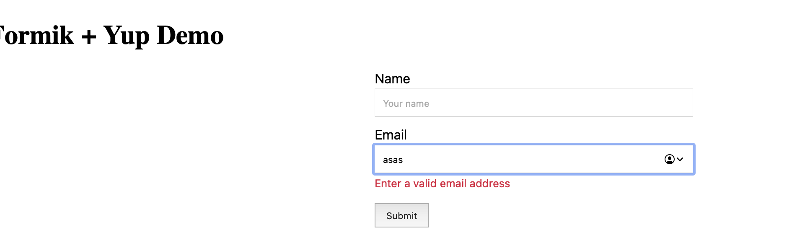
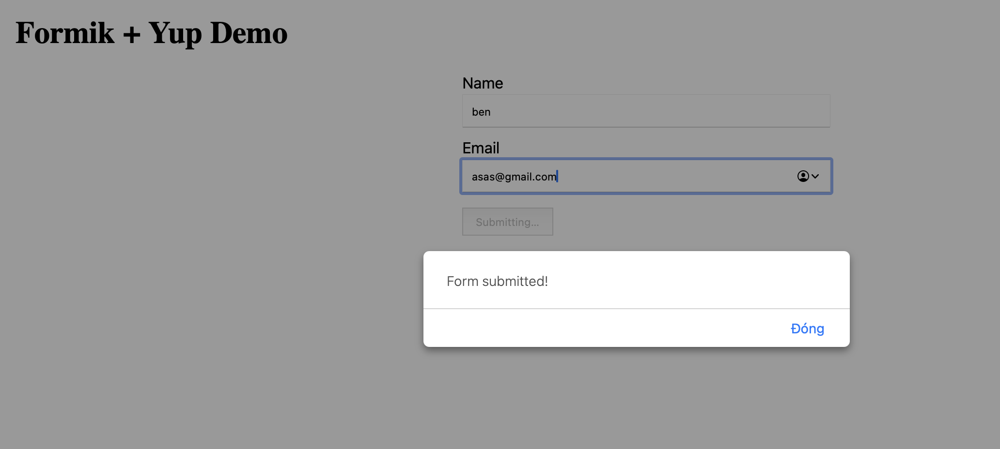
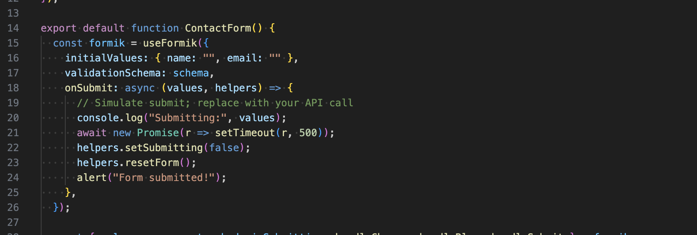
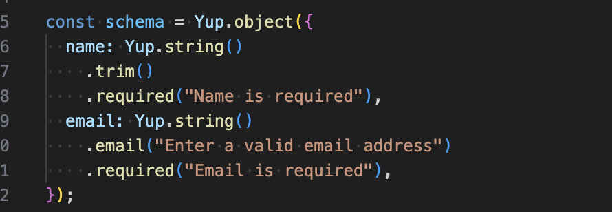

# Handling Forms with Formik

## Task

1. Research what Formik is and why it's useful for handling forms in React.

- Formik is a lightweight React library that handles the boring parts of forms: field state, change/blur handlers, submission state, and validation. Instead of wiring useState for every input and hand‑rolling validation, Formik gives you a single source of truth for form values and errors, plus helpers like handleChange, handleSubmit, and touched handling. Pair it with Yup for declarative, schema‑based validation.

1. Create a form with the following fields.

- Name (text input)
- Email (validated with Formik & Yup)
- A submit button

1. Use Formik’s useFormik hook or <Formik> component for form handling.

1. Implement basic validation using Yup.

## Reflection

1. How does Formik simplify form management compared to handling state manually?
Formik puts form state (`values`, `errors`, `touched`, `isSubmitting`) in the middle and provides you with pre-made handlers (`handleChange`, `handleBlur`, `handleSubmit`). Otherwise it requires a separate `useState` and hand-rolled onChange/onBlur behavior and manual error tracking and boilerplate to render buttons disabled when submitting, their inputs blanked on reset. In Formik, the issues are addressed in a single location, thus decreasing code, eliminating field drift and making complicated forms simpler to guarantee and test.
2. What are the benefits of using Formik’s validation instead of writing validation logic manually?
Formik has a neat integration with Yup such that validation becomes declarative schema. This brings:

- Consistency: all the rules of a form are covered by one schema.
- Improved UX: errors are automatically mapped to fields and `touched` control and submission is blocked on invalid fields.
- Maintainability: update a rule in one place; it will be applied anywhere used schema.
- Supported edge cases: Email formatting, required fields, trimming, min/max, custom tests, and async checks are all supported off the shelf.
- Separation of concerns: UI only does ex-rendering; validation logic exists in the schema, and reads better and is re-usable.
