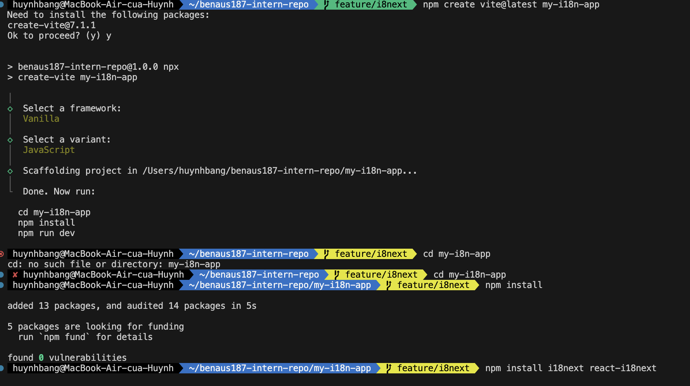
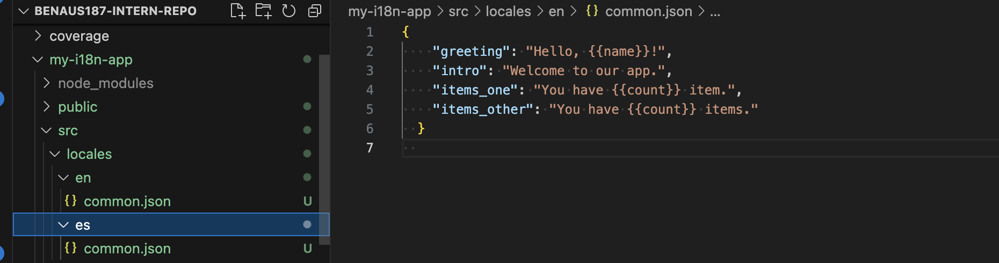
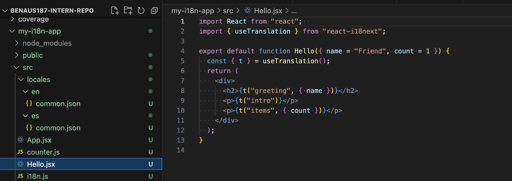
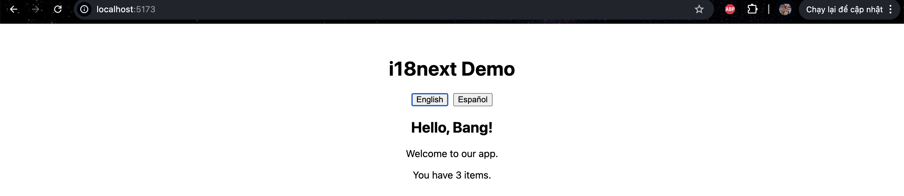
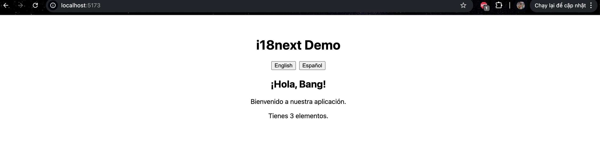

# Implementing Internationalization with i8next

## Task

1. Research how i18next works in React and why internationalization is important.
    i18next is a popular internationalization (i18n) framework. With react‑i18next, it plugs into React so you can:
    - keep translations in JSON files (per language, per namespace),
    - handle interpolation (Hello, {{name}}), plurals, context (e.g., gender), and formatting,
    - switch languages at runtime without reloading,
    - lazily load translations and detect user language.
    Why internationalization matters
    - Users understand and trust apps in their own language.
    - Many regions have legal or accessibility expectations for local languages and formats.
    - It improves UX, reach, and conversion—and avoids hard‑coding text all over the UI.
2. Set up i18next in a React project.

3. Create translations for at least two languages (e.g., English & Spanish).

4. Use useTranslation to display a translated message in a React component.

## Reflection

1. What challenges did you face while setting up i18next?
    Among the primary difficulties that I encountered was setting the initialization procedure in i18n.js appropriately. The file paths to load the common.json files used to provide translations were fragile and minor errors resulted in the failing to load these translation files. Using i18next with React components also proved to be a challenge, particularly to learn the use of the useTranslation hook. I was also forced to use trial-and-error with how I arranged my keys in JSON to have a well-organized yet simple form to use. It took some close debugging of the translation files as well as the component logic to figure out why some keys were not appearing properly.
2. Why is it important to use a library like i18next instead of manually handling translations?
    The importance of using a library such i18next is that in more significant projects hand-editing of translations becomes enormously cumbersome. Otherwise, developers would have to develop their translation storage, language switching and pluralization or fallback functionality themselves. Not only would this expand development time but also cause inconsistencies and possible bugs. i18next offers a tried and tested structure to make such work easy but maintain advanced functionality such as interpolation, pluralization and locale detection. It fits with React as well - the entire translation process is much more efficient and reliable.
3. How would you handle dynamic content (e.g., user-generated text) in a multilingual app?
    Dynamic content Dynamic interface content cannot easily be placed in JSON translation files as can be done with static interface text. One solution to this is to translate user-generated text on the fly by using external translation services or APIs (e.g. Google Translate or DeepL). Crowd sourcing is another like helping the users to add their custom translations, as usually done with community based applications. In the event that none of these two may apply, the system must at least make it clear when a certain material is not available in the preferred language of the user. This eliminates confusion whilst achieving transparency and also a multilingual experience.
