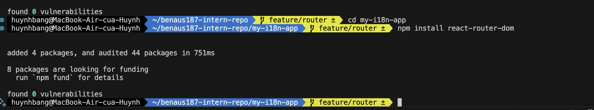

# React Fundamental

## Navigation with React Router

### Task - react router

1. Install React Router and set up a basic routing system.

2. Create two pages: Home.js and Profile.js.

3. Add navigation between the two pages (e.g., using Link or useNavigate).

### Reflection - react router

1. What are the advantages of client-side routing?

With client-side routing, the changes in UI do not have to reload the entire page on the server side. This enhances performance in that only the dynamic portions of the page are re-rendered. It makes the user experience smoother, as well, because the navigation is instant and closer to a desktop application. The other advantage is state persistence state data in memory (such as form input or react state) is never reset as one switches pages (as it would happen in conventional server-side navigation where an additional request to the server asks it to reset the page). Advanced routing also includes additional route navigation logic (e.g., access protection, conditionals) that can be implemented within a programming language, and is no longer forced to depend only on server routes.

## Working with Lists & User Input

### Tasks - List

1. Create a simple form with an input field and a button.

2. When the user enters text and clicks the button, add the text to a list.

3. Display the list dynamically using .map().

### Reflection - List

1. What are some common issues when working with lists in React?
In React, the most common mistake is inability to attach the key prop when dealing with lists. React cannot effectively keep track of what is newly added, removed, and updated without unique keys, could lead to rendering bugs and warnings. Another problem is that the array index is used as a key, which would be okay with lists that will not change, but would lead to unexpected behavior on lists that are rearranged or decreased. It is also crucial that developers make sure that list updates are processed in an immutable manner (e.g. avoid direct array mutations with setState([...items,newItem]) but use an immutable form). React won t re-render properly otherwise. Lastly, when the lists are really huge, performance may become a problem due to the unnecessary re-renders of the lists which can be alleviated using strategies such as React.memo, virtualization, or good state structuring.

## Styling with Tailwind CSS

### Task - styling

1. Convert Counter.js to use Tailwind CSS classes instead of regular CSS.

2. Create a Button component with Tailwind styling.

3. Add hover and active states using Tailwind utilities.

### Reflection - styling

1. What are the advantages of using Tailwind CSS?
The emails of Tailwind CSS have the advantage that the classes are utility-first, and it is easy to style the component directly in JSX files with no need to write specific CSS. It will provide consistency throughout the project, limit the need to switch between HTML and CSS, and prevent naming collisions because you do not need to design your own class names. It also facilitates easily applying responsive designs and state based style (hover, focus, active) using built in utilities.
2. What are some potential pitfalls?
The biggest downside is that JSX files will have long strings of classes which can make it less readable. Tailwind also has learning curve of learning to remember utility names and when you want to customize deeply styled components you would need to extract into reusable components or you may need to change configuration. Duplication of inline utilities and hard time managing design consistency can arise when the inline utilities and the project being worked on is just too big in scale to obviate and do the work without proper organization.

## Handling State & User input

### Task - state

1. Create a component Counter.js with a button that increments a number when clicked.

2. Use useState to manage the count value.

3. Display the count value dynamically.

### Reflection - state

1. What happens if we modify state directly instead of using setState?

- React editing state with the given setter (e.g. setCount ) is always preferable to editing the state variable in-place.
- When we update the state we get directly (e.g. count = count + 1), then React will not notice the change since it does not know that the state has been updated. This implies that the component will not re-render, the UI cannot be updated to the new value.
- Also, the direct mutation might cause surprising bugs, stale values, and break Reacts internal optimizations such as batching state updates. It is because by using setState (or the setter function, provided by the useState) all the time, React will make sure that the component is correctly re-rendered, and is kept in line with the state.
