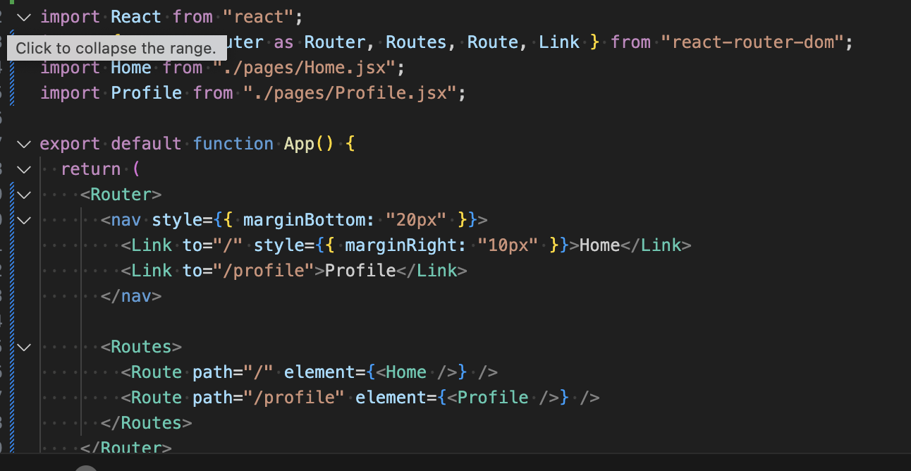

# React Fundamental

## Navigation with React Router

### Task - react router

1. Install React Router and set up a basic routing system.

2. Create two pages: Home.js and Profile.js.

3. Add navigation between the two pages (e.g., using Link or useNavigate).

### Reflection - react router

1. What are the advantages of client-side routing?

With client-side routing, the changes in UI do not have to reload the entire page on the server side. This enhances performance in that only the dynamic portions of the page are re-rendered. It makes the user experience smoother, as well, because the navigation is instant and closer to a desktop application. The other advantage is state persistence state data in memory (such as form input or react state) is never reset as one switches pages (as it would happen in conventional server-side navigation where an additional request to the server asks it to reset the page). Advanced routing also includes additional route navigation logic (e.g., access protection, conditionals) that can be implemented within a programming language, and is no longer forced to depend only on server routes.

## Working with Lists & User Input

### Tasks - List

1. Create a simple form with an input field and a button.

2. When the user enters text and clicks the button, add the text to a list.

3. Display the list dynamically using .map().

### Reflection - List

1. What are some common issues when working with lists in React?
In React, the most common mistake is inability to attach the key prop when dealing with lists. React cannot effectively keep track of what is newly added, removed, and updated without unique keys, could lead to rendering bugs and warnings. Another problem is that the array index is used as a key, which would be okay with lists that will not change, but would lead to unexpected behavior on lists that are rearranged or decreased. It is also crucial that developers make sure that list updates are processed in an immutable manner (e.g. avoid direct array mutations with setState([...items,newItem]) but use an immutable form). React won t re-render properly otherwise. Lastly, when the lists are really huge, performance may become a problem due to the unnecessary re-renders of the lists which can be alleviated using strategies such as React.memo, virtualization, or good state structuring.
