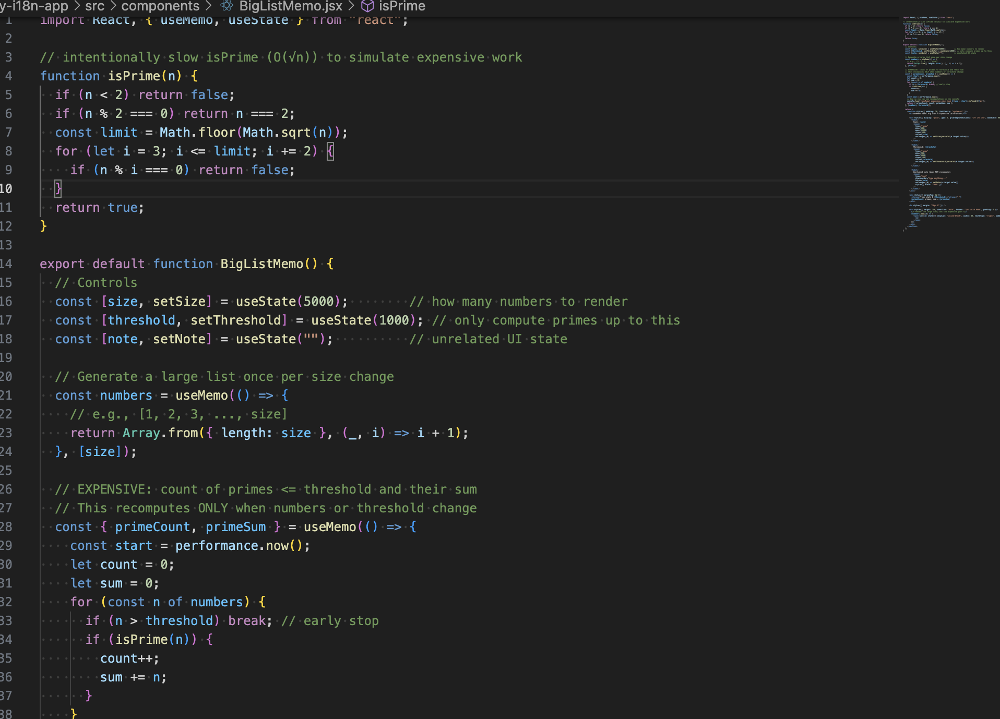
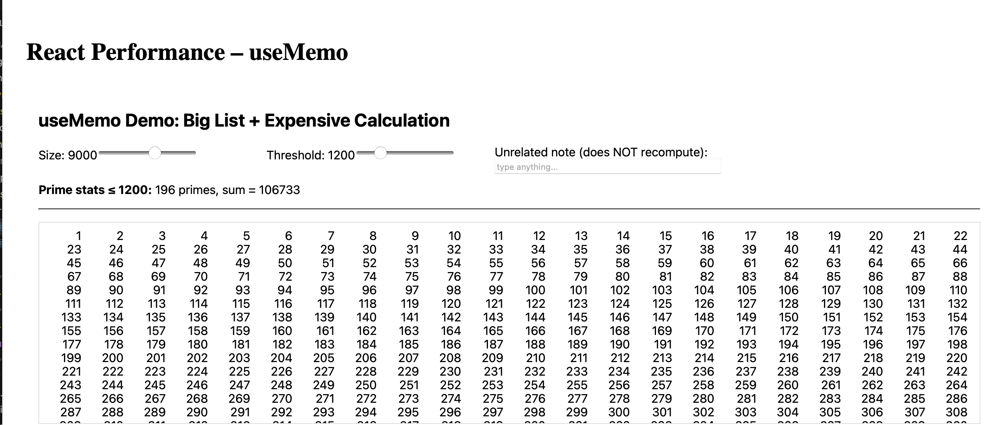
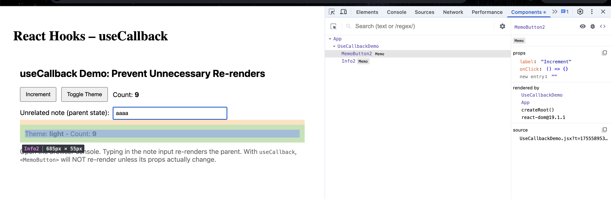
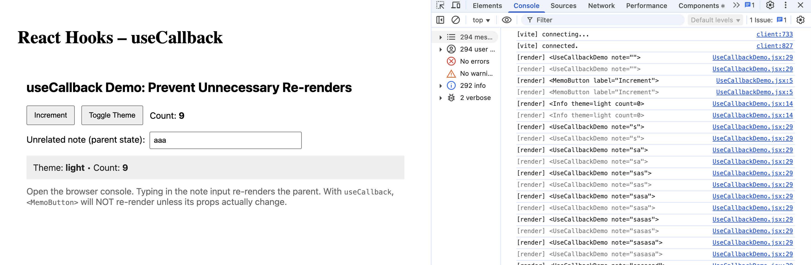

# React-hook

## Optimizing Performance with useMemo

### Task - useMemo

1. Research how useMemo works and why it's useful
useMemo(fn, deps) caches (“memoizes”) the result of an expensive computation. React will only re‑run fn when one of the dependencies in deps changes. This prevents heavy recalculations on every render caused by unrelated state updates (typing, toggling UI, etc.), improving responsiveness and CPU usage.
2. Create a component that:

- Renders a large list of numbers.
- Implements an expensive calculation that runs only when necessary.
- Uses useMemo to prevent unnecessary re-computation.

### Reflection - useMemo

1. How does useMemo improve performance?
useMemo as caching the output of a costly calculation, and recomputing the output only when dependencies change. This minimizes extraneous CPU work while re-rendering due to unrelated state change (e.g typing on an input). In reality this reduces the render time, keeps the UI responsive and avoids lagging on slower devices. In my demo, when I count primes and sum them it only re-runs on changing the value of `numbers` or `threshold`, not when I write a message string to an unrelated text field.
2. When should you avoid using useMemo?
Do not use Memo considerations with trivially cheap calculations or where dependencies are changing in essentially every render- the bookkeeping cost of Memo can be worse than the difference to the performance. Also bypass those values that are not significant to render time or user experience. Measured first: performance should not be regressed by removing useMemo, in which case the code is easier without `useMemo`.
3. What happens if you remove useMemo from your implementation?
The costly calculation takes place each render. Even other UI changes (such as editing a note field) would cause the prime counting loop to restart, using additional CPU time and resulting in apparent unresponsiveness at the application margin (longer lists, more expensive calculations). You would see log messages in the console when using the “expensive calc” on every keystroke (don later than you would expect); with `useMemo`, the log messages will only be printed when the relevant input values actually change.

## Preventing Unnecessary Renders with useCallback

### Task - useCallback

1. Research how useCallback works and when to use it
useCallback(fn, deps) memoizes a function reference so its identity stays the same across renders unless a dependency changes.
Use it when you pass a callback down to memoized children (React.memo) or into hook deps (e.g., useEffect) and you want to avoid re-runs/re-renders caused by a new function identity every render.
2. Create component that

- Passes a function as a prop to a child component.
- Uses useCallback to prevent unnecessary re-renders.
- Uses React DevTools to confirm when re-renders occur.

### Reflection - useCallback

1. What problem does useCallback solve?
useCallback will avoid unnecessary renders of child components who get functions as props. Otherwise, it causes React to create new complex component on each render making the memoized child components believe their props have changed, and re-rendering. useCallback allows you to memorize the function so that the relationship of the function identity does not change as long as the dependency does not change.
2. How does useCallback work differently from useMemo?
Both useMemo and useCallback are an optimization hook, even though they are slightly different:

- useMemo returns a memoized result (a calculation result).
- useCallback returns a memoized function (the function).
In short: useMemo caches results, and useCallback caches functions.

1. When would useCallback not be useful?
There is not necessarily a need to use useCallback. Memoizing may impose as much overhead as advantage, due to the small size of the function in question, and the simple tree of the component. It is most helpful when sending callback props to memoized or pure child components. When re-rendering is inexpensive, the utilization of useCallback will not result in a higher performance and may even confuse the code.
