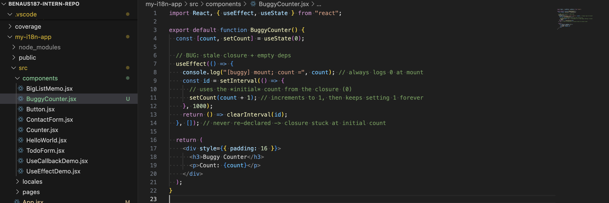
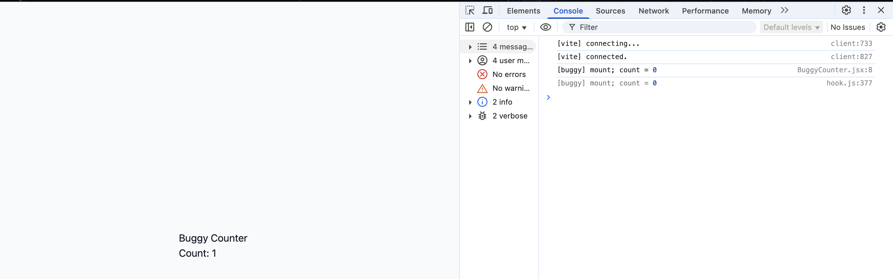
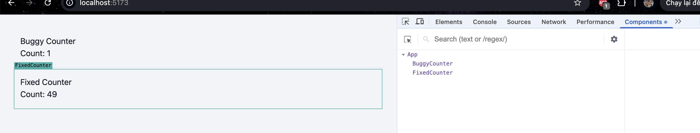
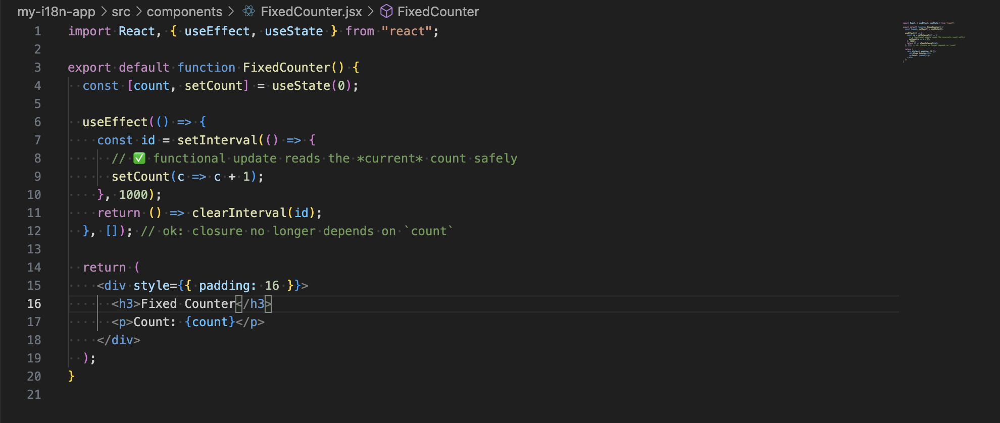

# Practice React Debugging in a Test Repo

## Task

1. What was the issue?
I implemented a counter using `setInterval` inside `useEffect` with an empty dependency array:

The counter jumped to 0 →1 and then it got stuck. The reason could only be a stale closure: the effect was being run once, thus the interval callback was still grabbing the first counter value (0). Every tick was actually 0 + 1 and React continued to update state with 1.

2. What debugging method did you use?
I used :

- Console logs inside the interval and on mount to inspect values over time.
- React DevTools to observe re-renders.
- Re-read the effect and dependency logic to reason about closures.

1. How did you resolve the problem?
I switched to a functional state update:
setCount(c => c + 1);
This reads the latest state value provided by React, so I can safely keep [] as the effect deps. Alternatively, including count in the dependency array and re-creating/cleaning the interval each render also works:

