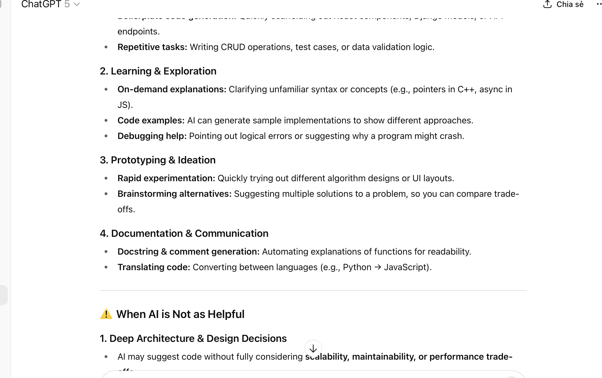
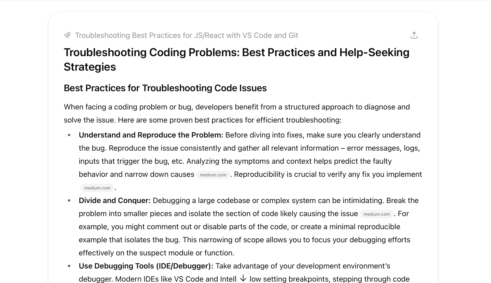
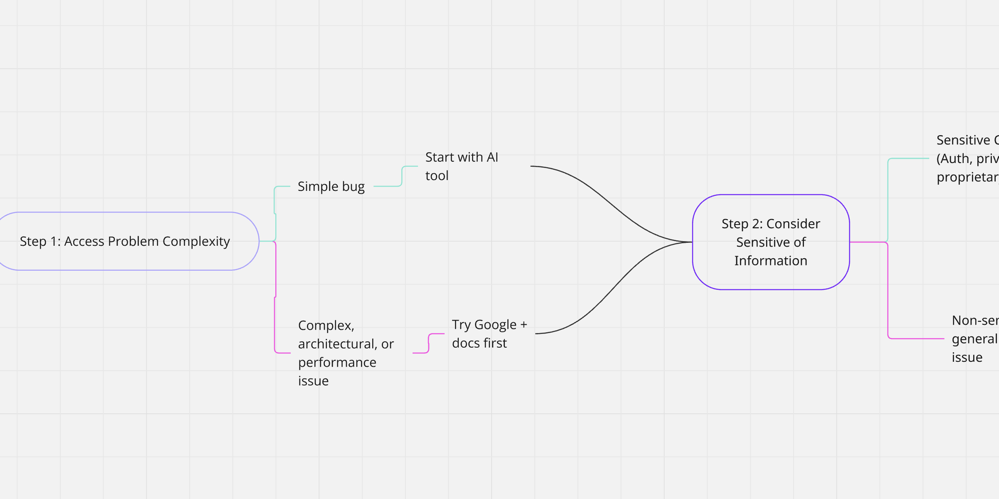

# When to use Google, AI tools, or Ask for Help?

## Task

1. Research best practices for troubleshooting coding problems.
Spend 30 minutes talking with Chat GPT to understand different perspectives on using AI in coding. When is it helpful and when is it not?

| AI is helpful | AI is not helpful |
|---------------|-------------------|
| Debugging Assistance and Explanations | Accuracy and "Hallucinations" |
| Generating Code Snippets and Boilerplate | Lack of context or Understanding |
| Learning and Documentation | Outdated or Incorrect Knowledge |
| Writing tests and spotting issues | Security and privacy concern |
| Prototyping quickly | Over-reliance and skill Atrophy |

1. Develop a decision-making framework:

- Create a flowchart or decision tree in Miro outlining scenarios where each resource (Google, AI tools, colleagues) would be most appropriate.
- Consider factors such as:
  - The complexity of the problem.
  - The sensitivity of the information.
  - The urgency of the task.

## Reflection

1. When do you prefer using AI vs. searching Google?
I also tend to use AI tools when I want faster answers in expectation, boilerplate code, or when interpreting a confusing error message. AI is especially practical in situations where I need a fast-prototyping or an instance when I need several possible solutions to compare.
I use Google when I require properly documented, community-verified solutions (e.g. Stack Overflow, official docs), or when I want to know whether or not other people have encountered the same problem with my particular framework or library.
2. How do you decide when to ask a colleague instead?
When I am wondering about a colleague, I tend to ask:

- I have already used AI and Google and the issue is not quite clear.
- The problem concerns the knowledge tied to the project (e.g. internal architecture).
- The job is pressing and I cannot afford to spend more time searching in the search alone.

1. What challenges do developers face when troubleshooting alone?

- Tunnel vision: looking too long at the same code.
- Too much search/AI dependency: searching snippets that we do not have the gist of.
- Overwhelming information: existence of conflicting solutions on the Internet.
- Time loss: when there is no established escalation, time is wasted running goose chases.

The ability to work in a team and combine the proper tool at the proper moment can help resolve these challenges.
