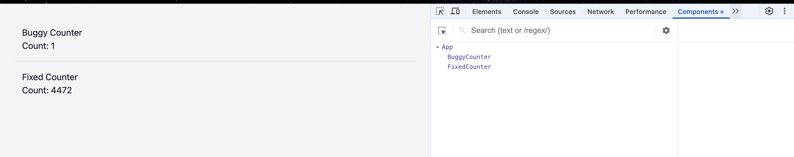
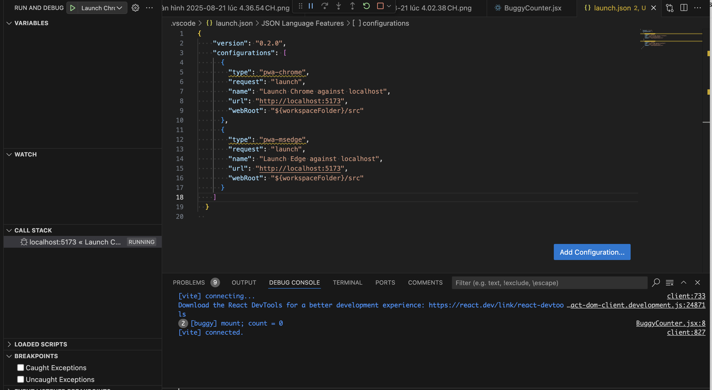
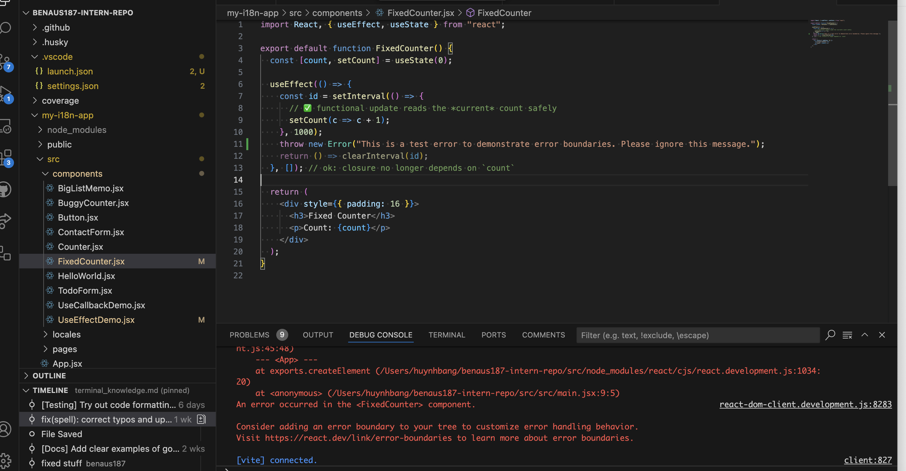
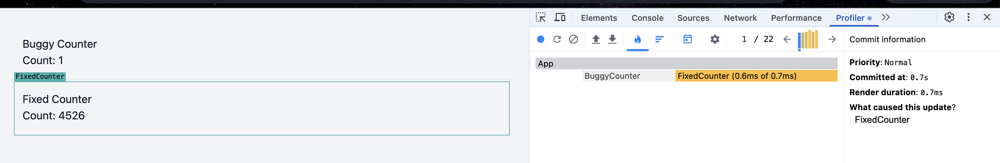

# Research Best Debugging Techniques for React

## Task

1. Research best debugging techniques for React applications

- Explore tools like React DevTools, browser console, and VS Code debugger.

  
  

- Learn about error boundaries and how to handle runtime errors.

  

- Investigate debugging performance issues using the React Profiler.

  

## What are the most common debugging techniques?

1. **Reproduce & reduce**
   - Make the bug 100% reproducible; strip code to a minimal example to isolate the cause.

2. **Read the full error**
   - Expand browser console stacks; enable source maps; check the Network tab (status, payload shape, CORS).

3. **Inspect live state**
   - Use React DevTools Components panel to view props, state, context, and hooks; confirm inputs match expectations.

4. **Use a real debugger**
   - Set breakpoints/conditional breakpoints/logpoints in VS Code; step through code paths instead of spamming `console.log`.

5. **Validate data early**
   - Add guards (null/undefined), PropTypes/TypeScript, and schema checks for API responses.

6. **Form a hypothesis → change one thing**
   - Toggle feature flags, comment a branch, or flip a prop to bisect behavior.

7. **Git techniques**
   - `git bisect` to find the introducing commit; `blame` to find ownership; create a throwaway branch for instrumentation.

8. **Write a failing test**
   - Capture the bug with RTL/Jest; fix until green; keep the test to prevent regressions.

9. **Use error boundaries**
   - Wrap routes/feature areas to catch render-time errors and show a safe fallback while you log/monitor.

## Which tools are most effective for React debugging?

- **React DevTools**
  - Components panel: inspect props/state/context/hooks; owner stack.
  - Profiler panel: measure render times, see “why did this render?”, highlight updates.

- **Browser DevTools (Chrome/Edge/Firefox)**
  - Console: stack traces, `console.table`, `console.group`, `console.trace`.
  - Sources: breakpoints, conditional breakpoints, logpoints, blackboxing vendor bundles.
  - Network: request/response + payload inspection, throttling.
  - Performance: CPU flame charts, layout/paint insights.

- **VS Code debugger**
  - Launch/attach to Chrome/Edge/Node, watch variables, call stack, conditional breakpoints, inline logpoints.

## How do you debug issues in large React codebases?

1. **Start with a crisp repro path**
   - Record exact steps, inputs, and environment; capture HAR if network-related.

2. **Own the smallest failing boundary**
   - Identify the smallest component/hook where the bug still reproduces; move downward until the fault is local.

3. **Trace data flow**
   - Search for prop/state origins; follow selectors, contexts, and custom hooks; confirm invariants at each hop.

4. **Use the Profiler early (for “slow”/“lag”)**
   - Profile the action, open the slow commit, identify hot components, and check “why did this render?”

5. **Stabilize identities**
   - Memoize heavy children (`React.memo`), stabilize callbacks/values (`useCallback`/`useMemo`) to kill accidental re-renders—verify with Profiler.

6. **Instrument safely**
   - Add temporary structured logs (with IDs and inputs) or logpoints (no rebuild needed); remove after the fix.

7. **Leverage tests**
   - Write an RTL test that reproduces the bug at the boundary you found; this locks the failure in place and guides the fix.

8. **Git archaeology**
   - `git bisect` to find the introducing commit; `blame` to locate domain experts; check PR discussions/ADRs for intended behavior.

9. **Modularize the fix**
   - Prefer local, low-risk changes; avoid “big-bang” refactors while the bug is still poorly understood.

10. **Escalate smartly**
    - If blocked after a focused effort (e.g., 30–60 min), ask the domain owner with your repro, what you tried, and key logs/Profiler screenshots.
