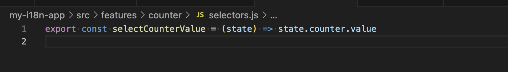
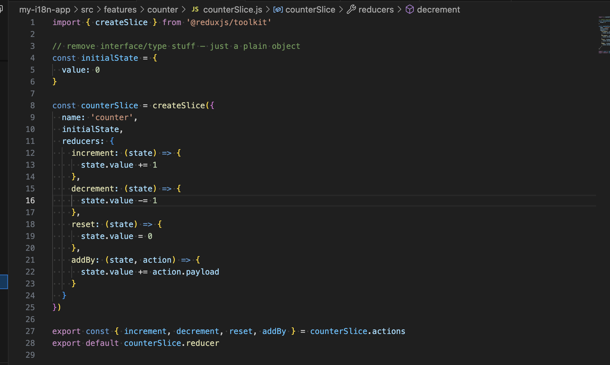
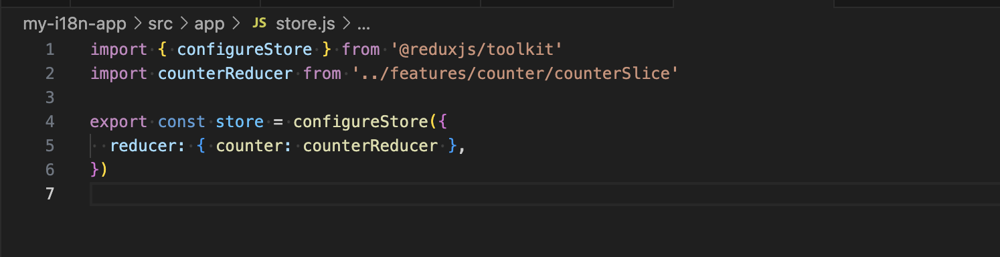
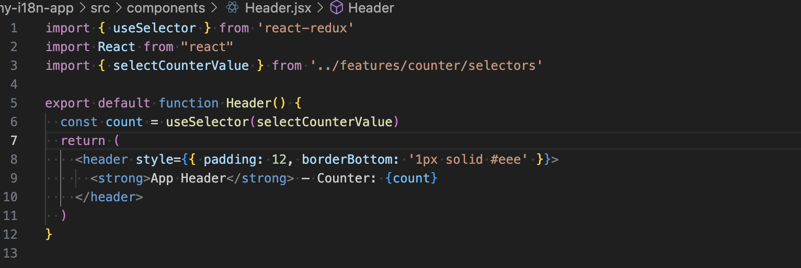
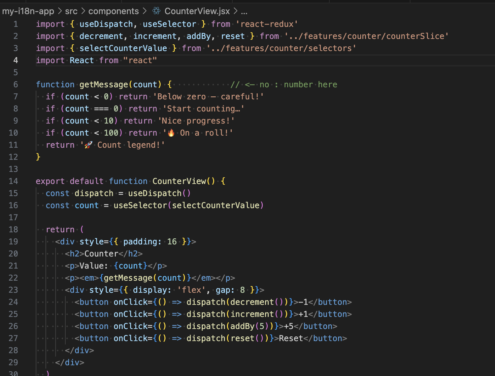
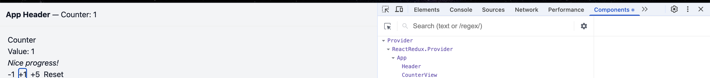
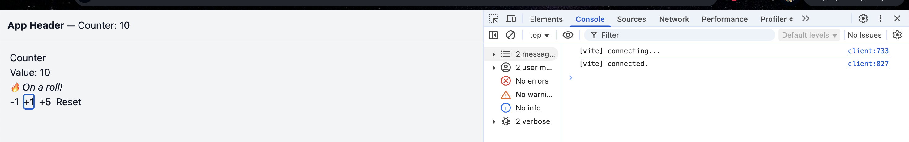
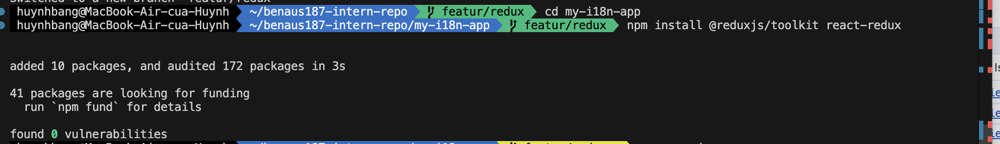
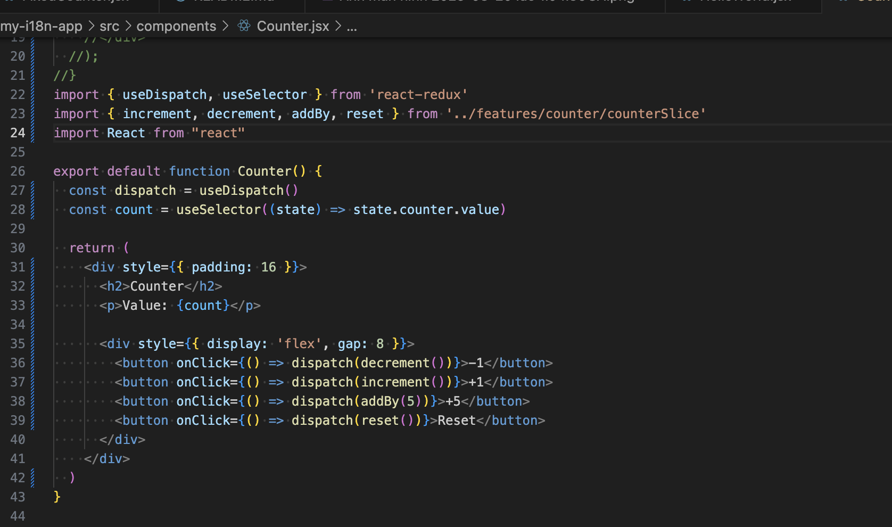
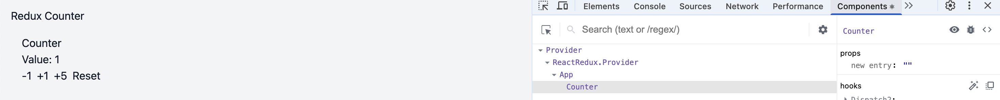

# Redux Toolkit

## Using Selectors in Redux Toolkit

### Task - Redux Toolkit

1. Create a selector function to get the current counter value from Redux.

2. Use useSelector to access the counter value in multiple components.

3. Modify the app to display different messages based on the counter value.

### Reflection - Redux Toolkit

1. What are the benefits of using selectors instead of directly accessing state?

1. Encapsulation and Abstraction

- Selectors act as a single source of truth for how a piece of state should be read.
- Components don’t need to know the exact shape of the Redux store; they just use the selector. If the state shape changes later, only the selector needs updating, not every component.

1. Reusability

- A selector function can be reused across multiple components.
- This avoids repeating state.counter.value (or similar) in different places.

1. Maintainability and Readability

- Code becomes easier to read since selectors have descriptive names (e.g., selectCounterValue) instead of raw property chains.
- Makes the intent of the code clearer.

1. Testability

- Selectors are pure functions, so they can be unit-tested independently of components.
- This increases confidence that the state access logic is correct.

1. Performance (with memoized selectors)

- Libraries like Reselect let selectors memoize their results.
- This prevents unnecessary re-renders by only recalculating derived data when inputs actually change.

## Introduction to Redux Toolkit (State Management)

### Task - Introduction

1. Install Redux Toolkit and React Redux.

2. Create a Redux store and configure a slice for a counter.

3. Use useSelector and useDispatch to connect Redux to the Counter.js component.

### Reflection - Introduction

1. When should you use Redux instead of useState?
Use useState for on component side, local and simple state.
Select Redux when :

- Several remote elements require the identical condition (global/ shared state).
- You require repeatable changes as in time travel debugging, middleware, or devtools.
- It is server/cache coordination, optimistic updates, or tricky async flows (RTK Query can help).
- You require business logic (considerably) and selectors centralized where it can hopefully be easily testable and disconnected components with shape changing.
- The app has cross‑cutting concerns (auth, feature flags, theming beyond context scale) which are bigger than useState/Context.
