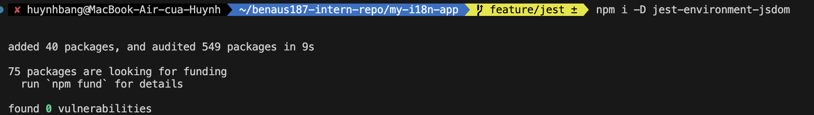

# Testing with Jest

## Testing Redux with Jest

### Tasks - redux

1. Research how to test Redux reducers and actions in Jest.

2. Create a simple Redux slice (if not already created).

3. Write a test that checks if a reducer updates state correctly.

4. Write a test for an asynchronous Redux action (if applicable).

5. Run the tests and check that they pass.

### Reflection - redux

1. What was the most challenging part of testing Redux?
The trickiest factor was working with asynchronous operations The thunks and async logic add some states such as pending, fulfilled and rejected, which complicate thunks and make them harder to test. These could be simulated without being able to make a hit to a real API by mocking or calling the thunk lifecycle actions yourself It took a weighing of options to only confirm the state changes we were really interested in as well as maintain the tests reputable and quick.

2. How do Redux tests differ from React component tests?
Redux tests target state changes- it checks that given an action, reducer returns the right new state. They do not normally make _any_ use of the DOM. In comparison to Jetpack Compose, the testing of React components is oriented on UI visualization and interaction. In those tests, they attach their components use the click or typing and assert what the user sees. Concisely, Redux tests will ensure the data logic is correct and React component tests ensure the user interface and behavior are correct.

## Mocking API Calls in Jest

### Tasks - api

1. Research how to mock API calls in Jest using jest.fn() and jest.mock().

2. Create a React component that fetches and displays data from an API.

3. Write a Jest test that mocks the API call and verifies the component’s behavior.

4. Run the test and check that it passes.

### Reflection - api

1. Why is it important to mock API calls in tests?
Mocking allows fast, deterministic and isolated tests. You sideline network flakiness and rate limits, can dictate exact responses (success/failure), and can concentrate on verifying your code behavior (loading states, error handling, rendering) instead of how the external services behave.

2. What are some common pitfalls when testing asynchronous code?

- Forgetting to await: forgetting to use await waitFor(...) (or findBy...) produces flakey tests that read the UI without an update.
- Leaky mocks: failure to put global.fetch/module mocks back to their initial state between tests can result in inter-test contamination.
- Implementation over behavior: It makes tests fragile to assert on what is not visible (or visible) on the user interface. Follow the user interface. prefer what the user sees.
- Use of real timeouts: long setTimeouts make the tests slow; when possible, use resolved promises or fake timers.
